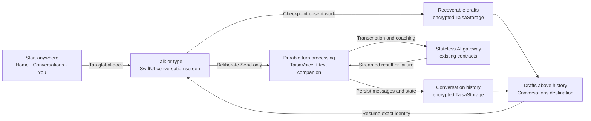

# Native Conversation Experience — Work Map

**Status:** Active — Build
**Last updated:** 2026-10-08
**Tier:** Full

**Build baseline:** `preview/taisa@4582a5e7d1c446275ac2a83c63a33ce335e4f8e5`, with accepted Home ancestor `44b5a08a8727729dea55a6238760d85f2dc0bff3` and native voice ancestor `01063fa725d067e4aa81befafa59f8fb1d995ac7` verified in history.

## Contents

1. [Platform — durable conversation and draft records](#1-platform--durable-conversation-and-draft-records)
2. [Platform — text and voice turn orchestration](#2-platform--text-and-voice-turn-orchestration)
3. [Product — primary navigation and global conversation dock](#3-product--primary-navigation-and-global-conversation-dock)
4. [Product — Conversations history and drafts](#4-product--conversations-history-and-drafts)
5. [Product — live conversation experience](#5-product--live-conversation-experience)
6. [Integration — recovery, privacy, and end-to-end verification](#6-integration--recovery-privacy-and-end-to-end-verification)

## At a glance

## Slices

| Slice | Owner | Outcome | Depends on | Approval point | Size | Status |
|---|---|---|---|---|---|---|
| 1. Durable conversation and draft records | Platform | Multiple voice/text drafts, lifecycle state, titles, corrections, and deletion survive relaunch securely | encrypted native storage | Scope + Plan | L | Complete |
| 2. Text and voice turn orchestration | Platform | Existing voice coordinator and a text companion expose one durable conversation contract without duplicate paid work | Slice 1; native audio/streaming foundation | Scope + Plan | L | Complete |
| 3. Primary navigation and global dock | Product | Home, Conversations, and You share one persistent Talk to Taisa affordance | functional Home; Product design handoff | Plan | M | Complete |
| 4. Conversations history and drafts | Product | Drafts appear above completed conversations and support resume, discard, rename, and delete paths | Slice 1; Product design handoff | Plan | M | Complete |
| 5. Live conversation experience | Product | Voice-first full-screen conversation supports keyboard replacement, deliberate Send, Reply, correction, and accessible states | Slice 2; Product design handoff | Plan | XL | Complete |
| 6. Recovery, privacy, and end-to-end verification | Integration | Interruption, failure, cleanup, navigation, and device behavior work as one verified flow | Slices 1–5 | Review + QA + Ship | L | In progress |

## Recommended pickup order

1. Complete Product design handoff for navigation, dock, history, drafts, and conversation states while Platform planning prepares for slices 1–2.
2. Build slice 1, then slice 2 after Plan approval.
3. Build Product foundation for slices 3–5 against typed fixtures once the Product Plan is approved.
4. Wire Product to the live Platform contract after slices 1–2 reach Build exit.
5. Complete integration verification and canonical-preview device QA.

Platform slices 1–2 and the Product design handoff may proceed in parallel after Scope approval. Product foundation may begin after Product Plan approval, but live wiring waits for the named Platform contracts.

**Critical path:** durable records → turn orchestration → live conversation wiring → recovery/privacy verification → canonical preview → Baah device QA.

**Progress:** overall 5/6 · Platform 2/2 · Product 3/3 · Integration 0/1. Deterministic preview verification is active on `feature/native-conversation-experience`; signed-device QA and Ship remain open.

## 1. Platform — durable conversation and draft records

Store multiple independent drafts and completed conversations in encrypted local storage. Preserve voice audio only while an unsent or recoverable draft needs it. Model local fallback titles, one first-response refinement, manual-title authority, transcript revisions, and visible-message supersession without losing provenance.

## 2. Platform — text and voice turn orchestration

Extend the shipped native voice lifecycle instead of creating a parallel recorder. Add an equivalent durable text-turn boundary and a shared conversation-facing contract for send, retry, reconciliation, correction, cleanup, and waiting for an explicit Reply action.

## 3. Product — primary navigation and global conversation dock

Create the Home, Conversations, and You shell. The Talk to Taisa dock remains available across primary destinations and opens a new full-screen conversation that starts listening only after the explicit tap. An open conversation replaces the global dock with its own composer.

## 4. Product — Conversations history and drafts

Show a dedicated Drafts section above chronological completed conversations. Voice drafts reopen paused; text drafts restore exact text. Drafts support resume and confirmed discard. Completed conversations support open, rename, and confirmed delete.

## 5. Product — live conversation experience

Preserve the accepted React Native interaction rhythm: recording, pause/resume, keyboard replacement with confirmed recording discard, and explicit Send. After Taisa replies, wait for a deliberate Reply tap. Closing unsent work offers Save draft or Discard; empty conversations close without creating a record.

## 6. Integration — recovery, privacy, and end-to-end verification

Prove that permissions, offline states, app backgrounding, force termination, audio interruptions, ambiguous network completion, retries, title refinement, transcript correction, cleanup, and navigation all preserve one authoritative conversation identity without duplicate messages or paid requests.
