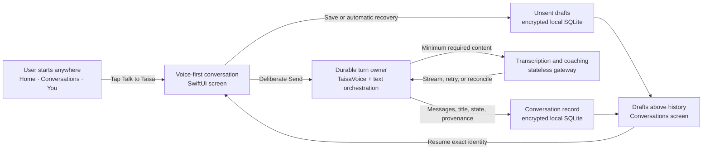

# Native Conversation Experience

**Track:** Platform + Product
**Tier:** Full
**Status:** Build — Plan approved
**Last updated:** 2026-10-07
**Work Map:** `docs/features/native-conversation-experience-work-map.md`

**Scope approved by Baah:** 2026-10-07

**Design handoff approved by Baah:** 2026-10-07

**Plan approved by Baah:** 2026-10-07

## At a glance

The device owns readable drafts, conversations, messages, raw draft audio, and recovery state. The gateway receives content only after deliberate Send and remains stateless for readable conversation history. Opening Home or Conversations never triggers an AI request.

## Discussion decisions

- The feature uses the native SwiftUI client and extends the durable native voice foundation; React Native is the behavioral reference, not the implementation architecture.
- Home, Conversations, and You share a global `Talk to Taisa` dock. An open conversation replaces the dock with its own composer.
- Tapping the dock is the explicit microphone action: it opens a new full-screen conversation and begins listening immediately.
- Only tapping Send may initiate transcription or coaching. Silence never submits.
- After Taisa replies, recording stays inactive until the user taps Reply.
- Voice and text are mutually exclusive. Switching from voice to keyboard requires confirmation and permanently discards the current recording; cancelling returns to the exact recording or paused state.
- Closing or dragging down with unsent input offers Save draft or Discard. Closing an empty conversation creates nothing.
- Multiple drafts are supported. Voice drafts reopen paused; text drafts restore their exact text. Neither resumes recording or sends automatically.
- App interruption or termination automatically checkpoints recoverable unsent input and surfaces it as a recovered draft.
- Transcription and send failures allow Retry, Save draft, or Discard rather than trapping the user on the screen.
- Successful voice Send transcribes and coaches directly without a transcript-review gate. A later transcript correction regenerates the affected assistant reply, replaces the exchange visibly, and retains the original internally for provenance.
- Successful sent turns retain their transcript and delete raw audio. Unsent and recoverable voice drafts keep audio locally until sent or discarded.
- A new conversation receives an immediate local fallback title. The first successful coaching response may refine it once without another AI call; manual titles are never overwritten.
- Conversations shows Drafts above completed history. Drafts open on tap and support confirmed discard. Completed conversations open on tap and support rename and confirmed delete.
- Search, folders, attachments, sharing, and coaching-mode selection are deferred.

## What is it?

Deliver Taisa's first complete native conversation journey. A person can start talking from any primary destination, switch deliberately to text, send only when ready, continue after Taisa replies, save more than one unfinished thought, and recover safely from interruptions or failures.

The experience adds the native primary navigation shell, global conversation dock, Conversations destination, full-screen composer, and the durable Platform contracts that keep drafts, turns, messages, titles, corrections, and cleanup trustworthy.

## Why now?

The canonical preview now proves the native Home page and the native foundation already contains encrypted storage plus durable voice capture, transcription, coaching, retry, and cleanup machinery. The missing user-facing conversation journey prevents the app from completing its core daily loop. Building this slice next turns the visible Home baseline into a usable career-companion experience while reusing the strongest native foundations already completed.

## Acceptance criteria

- [ ] Home, Conversations, and You expose the same global Talk to Taisa dock; an open conversation replaces it with the conversation composer.
- [ ] Tapping the dock opens a new full-screen conversation and begins recording only because of that explicit tap.
- [ ] No transcription, coaching request, or user message is created before the user taps Send.
- [ ] Voice capture supports recording, pause, resume, and Send; after Taisa replies, the microphone remains inactive until Reply is tapped.
- [ ] Requesting the keyboard from recording or paused voice shows a destructive confirmation; cancelling restores the exact voice state and confirming discards the recording before opening an empty text composer.
- [ ] An empty text composer can return to voice; non-empty text exposes Send instead and is never silently discarded.
- [ ] Closing or dragging down with unsent voice or text offers Save draft and Discard; closing with no input creates no conversation or draft.
- [ ] The user can keep multiple drafts. Conversations presents Drafts above completed history, and reopening restores text exactly or restores voice paused without recording or sending.
- [ ] Backgrounding, audio interruption, force termination, and relaunch preserve recoverable unsent work as the same draft identity without starting a provider request.
- [ ] Transcription or coaching failure preserves the relevant input and offers Retry, Save draft, and Discard without duplicating a message or paid request.
- [ ] A successful voice Send persists the accepted transcript and conversation messages, then deletes raw audio after durable cleanup; draft audio remains local only while still required.
- [ ] A sent voice transcript can be corrected; the affected assistant reply is regenerated from the correction, the corrected exchange becomes visible, and the original exchange remains retained as provenance.
- [ ] A conversation has an immediate offline-safe local title; the first successful coaching response may refine an untouched title once, and a manual rename is never overwritten.
- [ ] Completed conversations open with their existing history and support rename and confirmed delete. Drafts support resume and confirmed discard.
- [ ] Opening Home or Conversations renders from encrypted local state without an AI or network request.
- [ ] Duplicate taps, overlapping actions, and ambiguous network completion cannot create duplicate recordings, messages, conversations, or paid requests.
- [ ] Microphone denial offers Settings and keyboard paths; large text, VoiceOver, reduced motion, keyboard avoidance, and minimum touch targets remain usable across the agreed iPhone and iPad matrix.
- [ ] The exact verified revision is integrated into `preview/taisa`, pushed, confirmed as the served preview revision, and passes Baah's device QA before Ship.

## Platform dependencies

- [ ] SwiftUI functional Home completes Review + QA and its accepted revision is accounted for in the conversation implementation branch.
- [ ] Native encrypted storage and recovery provide production-ready local repositories for conversations, messages, drafts, turn checkpoints, cleanup, and export/restore coverage.
- [ ] Native audio, transcription streaming, coaching streaming, connectivity, retry reconciliation, and audio cleanup foundations reach Build exit with their public contracts verified.
- [ ] The Product design handoff defines the navigation shell, global dock, Conversations states, conversation composer states, confirmations, failure states, transcript correction, and iPhone/iPad behavior before Product planning.

## Out of scope

- Search, filtering, folders, pinning, bulk actions, or archive organization.
- Attachments, images, files, links, sharing, collaboration, or conversation export UI.
- Selecting or exposing Mirror, Nudge, Challenge, or Direct coaching modes in the interface.
- Automatic listening after Taisa replies or submission after silence.
- Mixed voice-plus-text turns; switching input modes replaces the current unsent input through an explicit destructive confirmation.
- Keeping raw audio after a turn has been successfully transcribed, persisted, and cleaned up.
- AI or network work triggered merely by opening Home, Conversations, a draft, or a completed conversation.
- Redesigning Home content, adding conversation history to Home, or building unrelated You/settings capabilities.
- Cloud conversation storage, cross-device draft sync, authentication, Android, web, localization, widgets, or background microphone capture.
