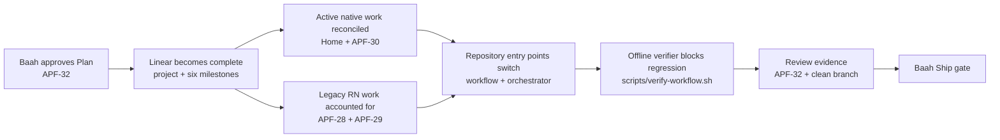

# Linear Roadmap Authority Implementation Plan

> **For agentic workers:** REQUIRED SUB-SKILL: Use superpowers:subagent-driven-development (recommended) or superpowers:executing-plans to implement this plan task-by-task. Steps use checkbox (`- [ ]`) syntax for tracking.

**Status:** Draft — awaiting Baah Plan approval
**Last updated:** 2026-10-07

**Goal:** Make Linear the sole live operating authority for Taisa delivery while keeping versioned technical truth, durable decisions, migrations, and verification evidence in Git.

**Architecture:** The migration first establishes the complete six-milestone native roadmap and reconciles active work in Linear. It then changes repository entry points and the offline verifier so they query Linear for live state and retain only code-adjacent contracts and history. Historical artifacts are preserved unless their information is explicitly migrated and their removal is part of this approved plan.

**Tech Stack:** Linear MCP, Markdown, Bash, ripgrep, Git, Node/npm workflow scripts.

**Spec:** `docs/superpowers/specs/2026-10-07-linear-roadmap-authority-design.md`

## Global Constraints

- Preserve Baah’s separate Scope, Plan, physical-device QA, and Ship gates; Linear status never substitutes for approval evidence.
- Do not modify Product behavior, product code, public contracts, persistence, privacy, or security boundaries.
- Preserve dirty worktrees, unique commits, unmerged branches, historical scopes/plans, and migration evidence.
- Do not create duplicate Linear projects, milestones, or issues; search exact and semantic matches before every creation.
- Do not merge, delete branches/worktrees, cancel unaccounted work, or rewrite shared history.
- The verifier must run without network access and must not mutate Linear.
- `main` remains the only shipping branch; this plan executes on `codex/linear-roadmap-authority` until Ship approval.

## Architecture and dependency path



Critical path: Plan approval → milestone reconciliation → active/legacy issue reconciliation → repository authority rewrite → offline verification → review → Ship.

## Review Focus

- Linear is unavailable at session start: already-approved work may continue only from trusted recent context and Git evidence; no new task, stage change, or blocker claim is inferred.
- A semantically equivalent milestone or issue already exists under different wording: update it instead of creating a duplicate.
- Linear status conflicts with a Draft repository artifact or missing approval evidence: advancement stops and the stale side is repaired; status alone never authorizes Build.
- Historical documents contain stale roadmap wording: active entry points must not cite them as current authority, while historical artifacts remain preserved and recognizable as history.
- A new Quick task or future idea arrives: it receives an issue before action; purely prospective direction belongs in a milestone description until someone takes responsibility.

---

### Task 1: Pin the new authority model in the offline verifier

**Files:**
- Modify: `scripts/verify-workflow.sh`
- Test: `scripts/verify-workflow.sh`

**Interfaces:**
- Consumes: repository instruction files and canonical project/team identifiers.
- Produces: an offline, read-only verification command (`npm run verify:workflow`) that rejects duplicate live authority and missing gate/offline rules.

- [ ] **Step 1: Add failing assertions for the target model**

Add checks equivalent to:

```bash
test ! -e docs/roadmap.md || fail "repository roadmap duplicates Linear authority"
test ! -e docs/backlog.md || fail "repository backlog duplicates Linear task intake"

for source in AGENTS.md CLAUDE.md docs/workflow.md .claude/skills/taisa-workflow/SKILL.md; do
  rg -qi 'Linear.*sole live authority|sole live authority.*Linear' "$source" ||
    fail "$source does not declare Linear live authority"
  rg -qi 'Linear.*unavailable|offline fallback' "$source" ||
    fail "$source is missing the Linear offline fallback"
done

if rg -n 'Active Work table|docs/roadmap\.md|docs/backlog\.md' \
  AGENTS.md CLAUDE.md docs/workflow.md .claude/skills/taisa-workflow/SKILL.md docs/project-memory.md; then
  fail "active repository instructions still reference duplicate live authority"
fi

rg -q '31b0d99c-6f74-4c9c-af2a-12e6e25aabe0' \
  .claude/skills/taisa-workflow/SKILL.md || fail "Taisa Linear project ID is missing"
rg -q 'e95356d8-17f7-4700-bdfe-222782bea546' \
  .claude/skills/taisa-workflow/SKILL.md || fail "Taisa Linear team ID is missing"
rg -qi 'every actionable task.*Linear issue|Linear issue.*every actionable task' \
  .claude/skills/taisa-workflow/SKILL.md || fail "universal issue intake is missing"
```

- [ ] **Step 2: Run the verifier and confirm the intended red state**

Run: `npm run verify:workflow`

Expected: FAIL because `docs/roadmap.md`, `docs/backlog.md`, Active Work references, and old Quick/backlog exceptions still exist.

- [ ] **Step 3: Commit the red verification contract**

```bash
git add scripts/verify-workflow.sh
git commit -m "test: require Linear delivery authority"
```

### Task 2: Reconcile the six native milestones without duplication

**Tools:** Linear `get_project`, `list_milestones`, `search`, `save_milestone`.

**Interfaces:**
- Consumes: approved milestone names and descriptions from the spec; existing Taisa project UUID `31b0d99c-6f74-4c9c-af2a-12e6e25aabe0`.
- Produces: exactly six non-duplicate milestones whose IDs are reused by later issue updates.

- [ ] **Step 1: Read current project and milestone state**

Call `linear_get_project` with `includeMilestones: true`, then `linear_list_milestones` for the Taisa project. Search each proposed name before creating anything.

Expected: record the exact existing milestone IDs; currently the project contains no milestones.

- [ ] **Step 2: Create or update the six approved milestones**

Create only missing equivalents, in this strategic order:

1. `Native foundations`
2. `Functional native product`
3. `Combined Home and Insights`
4. `Voice and Senior Self`
5. `Visual refinement and platform integration`
6. `Release cutover`

Use the approved descriptions from the spec. The Combined Home and Insights description must explicitly retain This Week/carry-over, Keep Moving continuity, consolidated proposal review, one grounded lead insight with evidence, nested current/superseded/history views, local attention and notifications, capability governance, observation/recommendation/accepted-task separation, and no AI/network request merely on Home open.

- [ ] **Step 3: Read the milestones back and validate uniqueness**

Call `linear_list_milestones` again.

Expected: exactly one semantic milestone for each approved outcome, all under the existing Taisa project, with no duplicate project created.

- [ ] **Step 4: Record milestone evidence on APF-32**

Comment on APF-32 with the six names and IDs, the read-back result, and any existing milestone that was reused rather than created.

### Task 3: Reconcile active native work and legacy React Native issues

**Tools:** Linear `search`, `get_issue`, `list_comments`, `save_issue`, `save_comment`.

**Interfaces:**
- Consumes: milestone IDs from Task 2; Git/worktree revisions; active Codex chat evidence.
- Produces: accurate Linear issues for SwiftUI Home and APF-30, and preserved canceled history for APF-28/APF-29.

- [ ] **Step 1: Re-read authoritative implementation state**

Inspect:

```bash
git -C /Users/emmanuelbaah/.codex/worktrees/swiftui-home-scope/Taisa status --short --branch
git -C /Users/emmanuelbaah/.codex/worktrees/swiftui-home-scope/Taisa log -1 --oneline
git -C /Users/emmanuelbaah/.codex/worktrees/swift-native-audio-streaming/Taisa status --short --branch
git -C /Users/emmanuelbaah/.codex/worktrees/swift-native-audio-streaming/Taisa log -1 --oneline
git -C /Users/emmanuelbaah/Documents/Beats/VibeCoding/Taisa/.worktrees/preview-taisa status --short --branch
git -C /Users/emmanuelbaah/Documents/Beats/VibeCoding/Taisa/.worktrees/preview-taisa log -1 --oneline
```

Read the related active Codex chats and APF-30 comments. Stop rather than overwriting a newer revision, blocker, or approval state.

- [ ] **Step 2: Find or create the SwiftUI Home foundation issue**

Search exact and semantic matches for `SwiftUI Home foundation`, `native Home`, and the branch name. If no outcome-equivalent issue exists, create one in Todo/In Progress only as supported by approval and Git evidence, attach it to `Functional native product`, and include:

- branch and exact commit;
- approved scope/design/plan artifact links;
- Platform + Product labels;
- acceptance and canonical-preview/device-QA exit requirements;
- explicit distinction from the complete Combined Home and Insights milestone.

- [ ] **Step 3: Reconcile APF-30 against the live implementation chat**

Update APF-30 only if its current description or milestone is stale. Preserve Scope/Plan approval, record the exact feature and canonical-preview revisions, current physical-device blocker, verification evidence, next action, and `Voice and Senior Self` milestone.

- [ ] **Step 4: Cancel only the superseded React Native implementation issues**

Re-read APF-28 and APF-29. If their intended implementation is still React Native and is superseded by the native roadmap, set each to Canceled and add a comment containing:

```text
Canceled as a framework-specific React Native implementation superseded by the Swift-native roadmap. History is retained. This does not cancel the user outcome; follow native milestone/issue links for current delivery.
```

Link APF-28 to the functional product / Voice and Senior Self path as appropriate and APF-29 to visual refinement. Leave APF-27 Done as historical evidence.

- [ ] **Step 5: Read all affected issues back**

Expected: SwiftUI Home and APF-30 accurately represent live work; APF-28/APF-29 are Canceled with history and explanation; APF-27 remains Done; no unrelated issue is changed.

### Task 4: Make the Linear project itself describe the operating model

**Tools:** Linear `get_project`, `save_project`, `save_status_update`, `get_status_updates`.

**Interfaces:**
- Consumes: reconciled milestones and issues from Tasks 2–3.
- Produces: a project description and one status update that accurately explain the authority migration and active native work.

- [ ] **Step 1: Replace the stale project description**

Set the existing Taisa project description to state:

```markdown
Taisa is a native personal AI career companion. Linear is the sole live authority for roadmap milestones, actionable task intake, priority, ownership, stage, dependencies, blockers, Scope, Plan, acceptance, and gate evidence. Git remains authoritative for operating constraints, architecture and public contracts, durable decisions, migrations, and verification evidence that must version with code. Baah approves material Scope, Plan, physical-device judgment, and Ship.
```

Do not create another project.

- [ ] **Step 2: Publish one project status update**

Create an `onTrack` or evidence-supported `atRisk` update summarizing:

- the authority migration;
- the six reconciled milestones;
- APF-32 at Build only after Plan approval;
- SwiftUI Home and APF-30 active state;
- current device-QA blocker(s);
- Combined Home and Insights preserved as future critical-path work.

- [ ] **Step 3: Read the project and status update back**

Expected: the project UUID is unchanged; the description no longer calls Git the live roadmap authority; the status update links exact issue/revision evidence.

### Task 5: Rewrite repository entry points and retire duplicate live ledgers

**Files:**
- Modify: `docs/workflow.md`
- Modify: `.claude/skills/taisa-workflow/SKILL.md`
- Modify: `AGENTS.md`
- Modify: `CLAUDE.md`
- Modify: `docs/project-memory.md`
- Delete: `docs/roadmap.md`
- Delete: `docs/backlog.md`
- Modify: `scripts/verify-workflow.sh`

**Interfaces:**
- Consumes: the Linear operating model and IDs established in Tasks 2–4.
- Produces: repository instructions that consistently query Linear for live work and retain Git only for versioned technical truth and historical evidence.

- [ ] **Step 1: Rewrite `docs/workflow.md` around Linear orientation**

Remove the Active Work table, repository backlog capture, local roadmap maintenance, default feature scope/plan file creation, and housekeeping rules that duplicate live state. Preserve stages, Platform/Product/Integration boundaries, design-system rules, preview authority, verification matrix, Git safety, gates, and Ship transaction.

Add a session contract that requires:

1. query Taisa project, milestones, actionable issues, dependencies, blockers, priorities, and recent updates;
2. inspect Git/worktrees, approvals, plans/contracts, checks, preview and active chats;
3. reconcile contradictions before change;
4. create/find a non-duplicate issue before every actionable task, including Quick work;
5. store live Scope, design intent, Plan, acceptance, status, ownership and discussion in Linear;
6. keep repository docs only for code-adjacent constraints, contracts, decisions, migrations, and immutable verification evidence;
7. use the documented offline fallback without starting or advancing unverified work.

- [ ] **Step 2: Apply the same model to the orchestrator**

Update `.claude/skills/taisa-workflow/SKILL.md` so its startup, tier, autonomy chain, issue rules, stage actions, parked work, QA, documentation cadence, and closeout all use Linear. Retain project/team IDs and status/label IDs. Quick work gets a compact issue rather than an exception.

- [ ] **Step 3: Update repository entry points**

Update `AGENTS.md`, `CLAUDE.md`, and `docs/project-memory.md` so:

- startup reads Linear live state plus repository technical evidence;
- no file points to Active Work, `docs/roadmap.md`, or `docs/backlog.md` as current authority;
- historical scopes/specs/plans are described as history unless explicitly linked as current evidence;
- approval and dirty-worktree safety remain unchanged.

- [ ] **Step 4: Remove the migrated live ledgers**

Delete `docs/roadmap.md` and `docs/backlog.md` only after Tasks 2–4 account for their still-relevant direction and ideas in Linear milestone descriptions or issues. Do not delete historical feature scopes, specifications, plans, QA records, or migration manifests.

- [ ] **Step 5: Complete the verifier implementation**

Adjust old positive checks in `scripts/verify-workflow.sh` that required Work Maps, local scope/plan files, roadmap/backlog, Active Work, or project-memory links. Keep unrelated safety checks. Add explicit negative checks against reintroducing the obsolete authority model in active entry points.

- [ ] **Step 6: Run narrow verification until green**

Run:

```bash
npm run verify:workflow
bash scripts/verify-doc-freshness.sh \
  docs/superpowers/specs/2026-10-07-linear-roadmap-authority-design.md \
  docs/superpowers/plans/2026-10-07-linear-roadmap-authority.md
git diff --check
```

Expected: all pass with no network access.

- [ ] **Step 7: Commit the repository authority migration**

```bash
git add AGENTS.md CLAUDE.md docs/workflow.md docs/project-memory.md \
  .claude/skills/taisa-workflow/SKILL.md scripts/verify-workflow.sh \
  docs/roadmap.md docs/backlog.md
git commit -m "docs: make Linear the delivery authority"
```

### Task 6: Verify the migration against every acceptance criterion

**Files:**
- Modify: `docs/superpowers/plans/2026-10-07-linear-roadmap-authority.md`
- Test: `scripts/verify-workflow.sh`

**Interfaces:**
- Consumes: all Linear mutations and repository commits from Tasks 1–5.
- Produces: review-ready evidence on APF-32 and a clean branch eligible for the later Ship gate.

- [ ] **Step 1: Run repository verification**

```bash
npm run verify:workflow
bash scripts/verify-doc-freshness.sh \
  docs/superpowers/specs/2026-10-07-linear-roadmap-authority-design.md \
  docs/superpowers/plans/2026-10-07-linear-roadmap-authority.md
git diff --check origin/main...HEAD
git status --short --branch
```

Expected: all checks pass; only the plan closeout edit may remain before its final commit.

- [ ] **Step 2: Run semantic regression scans**

```bash
rg -n 'Active Work table|docs/roadmap\.md|docs/backlog\.md' \
  AGENTS.md CLAUDE.md docs/workflow.md .claude/skills/taisa-workflow/SKILL.md docs/project-memory.md
rg -n 'No formal Work Map, scope doc, or Linear issue|No Linear issue|Linear issues are created only' \
  AGENTS.md CLAUDE.md docs/workflow.md .claude/skills/taisa-workflow/SKILL.md docs/project-memory.md
```

Expected: no matches in active entry points.

- [ ] **Step 3: Read back Linear evidence**

Read the Taisa project, all six milestones, APF-32, SwiftUI Home, APF-30, APF-28, APF-29, and the latest project status update.

Expected: each acceptance criterion has direct evidence; no duplicate milestones/issues; no stale Git-canonical project description; no unauthorized status or approval inference.

- [ ] **Step 4: Record closeout evidence without claiming Ship**

Update this plan to `Status: Review — awaiting Baah Ship approval` and append a closeout containing exact milestone IDs, issue IDs, commits, verification commands/results, remaining risks, and explicit statements that Product behavior was unchanged and Ship is not yet approved.

- [ ] **Step 5: Commit closeout and update APF-32**

```bash
git add docs/superpowers/plans/2026-10-07-linear-roadmap-authority.md
git commit -m "docs: record Linear authority verification"
```

Set APF-32 to In Progress during approved Build, then comment the final branch revision and verification evidence when Build enters Review. Do not set Done and do not merge until Baah grants Ship approval.

### Task 7: Review, PR, and Ship transaction

**Tools:** `superpowers:requesting-code-review`, `superpowers:verification-before-completion`, GitHub PR tooling, Linear.

**Interfaces:**
- Consumes: clean verified branch and APF-32 review evidence.
- Produces: reviewed PR ready for Baah’s Ship decision; after explicit Ship approval, canonical `main` and Linear completion evidence.

- [ ] **Step 1: Run the required review skills**

Invoke `superpowers:requesting-code-review`, resolve every blocking finding, then invoke `superpowers:verification-before-completion` and rerun Task 6 verification from a clean worktree.

- [ ] **Step 2: Push and create the PR**

Push `codex/linear-roadmap-authority`, create a PR targeting `main`, link APF-32 and the approved spec/plan, list every acceptance criterion, and include exact verification evidence. Attach the PR to the Codex task.

- [ ] **Step 3: Stop at the Ship gate**

Present the verified review summary to Baah. Do not merge, mark APF-32 Done, delete branches, or remove worktrees without explicit Ship approval.

- [ ] **Step 4: Execute Ship only after explicit approval**

Use `superpowers:finishing-a-development-branch`; re-fetch, confirm clean/current state and correct PR base, rerun verification, squash-merge to `main`, verify local/remote/PR merge SHA agreement, clean only the accounted merged branch/worktree, and update APF-32 plus the Taisa project status update with the merge SHA.

