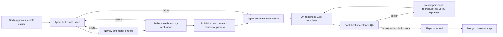

# Bounded Autonomous Delivery Design

**Status:** Proposed
**Last updated:** 2026-10-08

## Purpose

Taisa delivery should require Baah for product authority and physical judgment, not for routine testing, repair, tracking, or coordination. The current persistent Product and Linear goals overlap ownership, repeatedly reconcile global state, poll long-running checks, and create adjacent work while the approved work is waiting. This design replaces that pattern with one accountable, issue-bounded conductor.

Success means the agent can take one approved issue from kickoff through implementation, automated repair, canonical preview, and QA readiness without asking Baah to keep saying “continue.” In the ordinary path, Baah interacts twice: one kickoff approval, then one final acceptance-and-Ship decision. Separate Scope, Plan, physical-device, or Ship interactions remain only when risk or Baah's wording requires them.

## Approaches considered

### 1. Two persistent specialist loops

Keep separate Product and Linear loops but narrow their prompts. This preserves specialization, but both still need overlapping Git, issue, approval, and preview context. Coordination cost and ownership ambiguity remain. Rejected.

### 2. One permanent product-completion loop

Use one agent to continuously select and deliver work until the full product ships. This removes duplication, but the goal is too broad and long-lived. It encourages stale context, uncontrolled work-in-progress, opportunistic work during waits, and expensive global reconciliation. Rejected.

### 3. One issue-bounded conductor with event-based resumption

Run one conductor for one approved delivery slice. It owns implementation and housekeeping inside that boundary, becomes dormant at genuine gates or external waits, and stops after Ship/closeout rather than selecting the next issue. This preserves useful autonomy without continuous activity. Recommended.

## Operating model

Each delivery cycle has exactly one primary Linear issue and one accountable conductor. The issue supplies the approved outcome, stage, acceptance criteria, dependencies, and evidence. Git supplies versioned technical truth. The conductor may maintain Linear, Git, GitHub, documentation, tests, preview state, and review evidence only for the active issue and its approved sub-issues.

One delivery **cycle** may contain several bounded Goal runs separated by Baah-controlled gates. A Goal run always performs useful autonomous work toward one terminal handoff and then completes; it never remains active merely to await Baah, CI, a device, or an external service.

The normal internal lifecycle is:



The conductor does not start a new issue after closeout. It derives and presents the next recommended outcome from unresolved release blockers, Linear milestone priority and dependencies, the release critical path, approved product gaps, recent Baah feedback, and material product risk. Baah approves, rejects, reprioritizes, or pauses that recommendation. A milestone may supply context and ordering, but never expands one cycle beyond one primary issue or authorizes automatic successor implementation.

## Cycle control

### Goal runtime boundary

The Codex Goal is a bounded execution mechanism, not the permanent owner of an entire product or an idle approval queue.

- Before kickoff approval, ordinary chat/intake prepares the recommendation and approval bundle; no continuous Goal runs while Baah decides.
- After kickoff or separate Plan approval, create one issue-specific Goal whose terminal condition is the next Baah-controlled gate or completed external action.
- A Build Goal completes at one of four outcomes: `QA_READY`, `UNRESOLVED_ESCALATION`, `MATERIAL_REAPPROVAL_REQUIRED`, or `NON_DEVICE_SHIP_READY`.
- A repair Goal is a new bounded Goal on the same Linear issue and completes only at `QA_READY`, `UNRESOLVED_ESCALATION`, or `MATERIAL_REAPPROVAL_REQUIRED`.
- A Ship Goal begins only after clear Ship approval and completes after verified merge, cleanup, evidence, and next-outcome recommendation.
- Healthy CI or service work that can report completion asynchronously is awaited inside the same run without repeated reasoning. If no event-capable wait exists, the current Goal completes at `EXTERNAL_WAIT_RECORDED`; one scheduled or user-triggered continuation checks it later.
- A completed Goal does not auto-restart, select a successor issue, or infer approval. Baah's response or a meaningful external completion starts the next bounded run.

This preserves one accountable delivery cycle in Linear while preventing an active Goal from burning credits at human or external waits.

### Entry before Build

One lightweight intake session owns the front half of delivery:

1. The agent derives and recommends the highest-value outcome from Linear, critical-path evidence, approved product gaps, current blockers, risk, and Baah's latest feedback. Baah may also name an outcome directly.
2. The agent searches Linear for one matching non-duplicate issue and recommends the lightest fitting tier.
3. The agent conducts only the discovery needed to make the work decidable.
4. For Quick and ordinary Standard work, the agent presents one compact kickoff bundle containing the recommended outcome, user-visible result, inclusions, exclusions, key risks, implementation direction, and verification approach.
5. Baah's approval of that explicit bundle approves Scope and Plan together for that bounded issue.
6. For Full or high-risk work, the agent presents separate Scope and Plan gates.
7. The issue-bounded conductor starts with the named issue, milestone context, approved kickoff or separate Scope and Plan evidence, branch/worktree, completion condition, and next Baah gate.

Intake recommends the next issue by default; Baah does not need to search the roadmap or invent an outcome. The conductor cannot start it without Baah approving the explicit kickoff bundle or separate gates. Approval of a milestone does not approve every issue inside it.

### Fast path and high-risk path

The common path minimizes Baah's involvement:

```text
Agent: recommended outcome + compact kickoff bundle
Baah: approve
Agent: build → verify → repair → preview → smoke test
Baah: final acceptance; “looks good, ship it” may approve acceptance and Ship together
Agent: merge → close out → recommend next outcome → stop
```

Path selection is deterministic:

| Condition | Approval path |
|---|---|
| Quick or Standard, and no high-risk predicate below | One compact kickoff approval covers Scope and Plan |
| Full tier | Separate Scope and Plan approvals |
| Any tier with one or more high-risk predicates | Separate Scope and Plan approvals |
| Baah explicitly requests separate review | Separate Scope and Plan approvals |

High-risk predicates are: data migration or loss risk; privacy/security/trust-boundary changes; destructive or irreversible operations; public-contract or major architecture changes; paid services, credentials, or new external infrastructure; materially ambiguous product behavior; regulatory or consent changes; release strategy changes; or verification changes that could weaken an existing safety gate.

An earlier physical-device interaction is exceptional and must satisfy the instrumented-checkpoint rule. Internal CI, service, approval-processing, and preview-publication waits never create Baah interactions.

### Exclusive conductor states

The conductor is in exactly one state at a time:

| State | Entry | Permitted work | Exit |
|---|---|---|---|
| `INTAKE` | prior closeout or Baah direction | recommend outcome, deduplicate, prepare kickoff or high-risk gates | kickoff/Plan approved or Baah stops |
| `BUILDING` | kickoff bundle or separate Plan approved | implementation and narrow checks | stable candidate, material change, or blocker |
| `VERIFYING` | stable candidate exists | full matrix, review, PR checks | pass, repair needed, or blocker |
| `PUBLISHING` | verified device-facing commit exists | canonical preview integration and smoke checks | exact revision confirmed or repair needed |
| `AWAITING_BAAH_QA` | exact candidate passes the QA-readiness gate | no implementation; await named acceptance observation | accepted or defect observed |
| `REPAIR_QUARANTINE` | Baah reports a defect | reproduce, instrument, test, fix, verify, republish | replacement passes the repair-release gate |
| `AWAITING_SHIP` | acceptance QA complete without clear Ship intent | preserve state and await Ship decision | Ship approval or reopened defect |
| `EXTERNAL_WAIT` | healthy CI/service/device dependency is pending | one checkpoint, then dormancy | meaningful terminal change |
| `BLOCKED` | progress requires a user decision, credential, external change, or exhausted repair budget | preserve evidence; no adjacent work | blocker resolved or Baah stops |
| `CLOSEOUT` | Ship approved and merge conditions pass | merge, safe cleanup, evidence update | cycle complete and conductor stops |

Every transition records its trigger and evidence once. No wake-up may infer a different state from elapsed time alone.

The state table describes the Linear delivery cycle. Goal runtime uses the bounded terminal outcomes above; therefore `AWAITING_BAAH_QA`, `AWAITING_SHIP`, `EXTERNAL_WAIT`, and `BLOCKED` never require an active Goal to spin while waiting.

### Material change during the fast path

When execution discovers a material change, the conductor stops mutation, preserves the branch and evidence, and completes the current Goal as `MATERIAL_REAPPROVAL_REQUIRED`.

- If the revised work remains Quick/Standard and no high-risk predicate applies, present an amended compact kickoff bundle showing the exact delta.
- If it becomes Full or high-risk, replace the fast-path approval with separate revised Scope and Plan approvals.
- Prior approval remains historical evidence but does not authorize the changed outcome.
- After approval, start a new bounded Goal on the same Linear issue and preserved worktree.

## Work decomposition: Platform, Product, and Integration

These categories remain mandatory internal slices for Standard and Full cross-stack work. They are work ownership types, not separate persistent Goals, permanent branches, or automatic approval gates.

| Slice | Exclusive responsibility | Does not own |
|---|---|---|
| **Platform** | AI/backend behavior, storage, data ownership, infrastructure, privacy/security enforcement, and Product-facing contracts | screen layout, interaction presentation, or end-to-end release proof |
| **Product** | user journey, screens, interaction, accessibility behavior, and design-system consumption/foundation | backend persistence, service contracts, or cross-track release proof |
| **Integration** | contract wiring between completed Platform and Product slices, end-to-end states/failures, canonical preview, combined verification, and release readiness | inventing Platform capability or Product experience already owned by another slice |

Placement rules:

- Every planned task has exactly one slice owner.
- Cross-cutting concerns such as privacy, accessibility, performance, and verification are acceptance constraints applied to the owning task; they are not additional slices.
- Platform precedes Product only when Product depends on an unsettled contract. Independent Product foundation may proceed when its inputs are stable.
- Integration starts only when its named Platform producer and Product consumer are ready.
- Use one primary Linear issue and one conductor by default. Create a sub-issue or separate worktree only for an independently reviewable outcome, distinct owner, real dependency boundary, or separately shippable slice; it remains under the same cycle and conductor and cannot create another persistent Goal.
- Quick single-area work may state its single slice in one line instead of producing a Work Map.

## Work-in-progress boundaries

- One active implementation issue at a time.
- Discovery required for the active outcome stays inside the same primary issue. A second discovery issue cannot coexist in the active cycle.
- No new Scope, Plan, bug, cleanup, or documentation initiative merely because CI, a device check, or Baah is unavailable.
- Newly discovered adjacent work is recorded once in Linear and left unstarted unless it blocks the active acceptance criteria.
- A blocker may justify a bounded repair inside the same approved outcome. A materially different outcome returns to Scope.
- The conductor cannot coordinate, resume, or redirect another Codex chat unless Baah explicitly authorizes that action.

## Agent-owned verification and repair loop

After kickoff-bundle approval or separate Plan approval, the conductor owns the complete machine-verifiable loop:

1. Implement the smallest coherent increment.
2. Run the narrowest relevant unit, contract, integration, simulator, UI, accessibility, and static checks.
3. Diagnose failures and repair them without requesting routine direction.
4. Add regression coverage when practical and proportionate.
5. Repeat affected checks until green.
6. Run the complete applicable verification matrix once the candidate is stable.
7. Resolve blocking code-review findings and repeat affected checks.
8. Commit the exact verified revision.
9. Integrate and push that revision to `preview/taisa` when device-facing.
10. Confirm the preview runtime or installed build identifies that exact revision.
11. Perform all available simulator and preview smoke checks before involving Baah.

A successful compile is not QA readiness. A transient failure is not a reason to ask Baah to test. The agent continues until the failure is resolved, an approval boundary is reached, or a genuine external blocker is proven.

### Bounded internal persistence

“Loop until fixed” means persistent diagnosis, not unbounded repetition of the same action.

- Every failed attempt must produce new evidence, a changed hypothesis, a changed implementation, or a more discriminating test.
- Never rerun an unchanged failing command more than once solely to see whether it changes.
- After three unsuccessful attempts against the same supported hypothesis, pause execution, perform a root-cause review, and choose a materially different diagnostic path.
- After three root-cause paths fail, challenge the implementation approach before escalating: simplify or replace the affected component, test a minimal reproduction, compare with the last proven architecture, attempt a safe reversion where available, and obtain independent technical review when authorized.
- Enter `BLOCKED` only when further progress requires materially new Scope, credentials, destructive action, inaccessible private data, an external-state change, unavailable physical capability, or a Baah-controlled product compromise.
- A blocked repair does not become a Baah QA request. Baah receives only the smallest decision or external action needed to unblock engineering.
- `BLOCKED` is not fixed, accepted, complete, deferred, or ready for successor work. The same issue remains open, blocking, and unshippable until the repair-release gate passes or Baah explicitly approves redesign, reversion, deferral/removal, or a documented limitation.
- CI and external waiting time does not count as a repair attempt and follows the dormancy rules below.
- The conductor reports cumulative expensive full-suite runs and avoids another unless code, environment, or the release gate materially changed.

## Baah QA contract

Baah QA happens only after agent-owned verification is exhausted and an exact-revision candidate is ready. It is acceptance and physical-perception testing, not routine defect discovery.

Baah is asked to assess only matters the agent cannot establish reliably through code, automation, simulators, logs, or preview inspection, including:

- whether the journey solves the intended product problem;
- physical microphone, audio routing, haptics, permissions, and device performance;
- perceptual animation, comfort, clarity, and interaction quality;
- behavior with Baah's real data when privacy prevents agent inspection.

An earlier physical-device checkpoint is allowed only when a named hardware uncertainty blocks further implementation. The request must identify the exact revision, action, expected observation, and decision unlocked.

### Initial QA-readiness gate

The first candidate may reach Baah only when all applicable items pass:

1. Approved acceptance criteria are mapped to concrete evidence.
2. Narrow and complete applicable verification layers pass on the candidate revision.
3. Blocking code-review findings are resolved.
4. Platform, Product, and Integration slices required by the issue are complete.
5. Device-facing work is committed, integrated, and pushed to canonical preview.
6. The served or installed build is confirmed as that exact revision.
7. Agent-owned simulator, accessibility, preview, and smoke checks pass for the affected journey.
8. Known limitations and intentionally inapplicable checks are explicit and do not contradict acceptance.
9. Linear records the candidate revision, evidence, remaining risk, and exact Baah observation requested.

Failure of any applicable item returns to autonomous Build/repair. It does not produce a partial QA request.

### Device coverage

- Automated and simulator evidence covers every supported iPhone/iPad configuration named by the verification matrix.
- Baah performs physical QA only on device classes whose acceptance depends on hardware or perceptual judgment not otherwise established.
- One final interaction may contain a short, explicitly separated checklist for more than one required device; this remains one QA gate, not repeated exploratory rounds.
- A defect on either device class quarantines the affected acceptance criterion and follows the same repair-release gate before another request.

### One-observation defect quarantine

When Baah reports a defect once, that observation is sufficient to quarantine the candidate. The conductor must not ask Baah to repeat, reconfirm, further characterize, or periodically retest the same defect while engineering evidence remains incomplete.

The defect enters `REPAIR_QUARANTINE` and may return to `AWAITING_BAAH_QA` only after the **repair-release gate** passes:

1. Confirm the exact failed preview/build revision and matching architecture.
2. Convert Baah's observation into a stable reproduction, automated regression, diagnostic trace, or explicit contract assertion.
3. Identify and record a supported root cause rather than patching symptoms blindly.
4. Demonstrate that the reproduction fails on the defective revision where technically possible.
5. Fix the defect inside approved Scope.
6. Demonstrate that the same reproduction passes on the replacement revision.
7. Run affected integration, simulator/UI, accessibility, and regression checks.
8. Run the complete applicable release matrix when required by the change or release policy.
9. Resolve blocking review findings.
10. Commit, integrate, and push the exact replacement revision to canonical preview.
11. Confirm the served/installed revision and complete an agent-owned smoke test of the failed journey.
12. Provide Baah one concise retest request naming the original failure, replacement revision, evidence, exact action, and expected result.

The authoritative repair transition sequence is:

```text
Baah defect observation
→ REPAIR_QUARANTINE
→ bounded repair Goal
→ targeted reproduction and diagnosis
→ BUILDING replacement
→ VERIFYING repair-release evidence
→ PUBLISHING exact replacement
→ agent smoke check
→ QA_READY Goal completion
→ Baah focused retest
```

If the agent cannot establish sufficient evidence for any gate item, the issue remains quarantined or becomes `BLOCKED`. It is not returned to Baah as an exploratory test. Instrumentation may be added to the replacement build, but Baah is involved again only when that instrumentation is part of a deliberate, evidence-backed physical-device experiment that cannot be performed elsewhere and whose result unlocks a specific next action.

After the gate passes, Baah retests only the original failed behavior and journeys materially affected by the repair. A different observation creates a distinct defect record; it does not erase the evidence for the original repair.

### Two-outcome notification rule

While meaningful repair work is progressing, the conductor stays quiet except for material gate or safety changes. Baah is notified only when one of two outcomes is reached:

1. **Fixed and proven:** the repair-release gate passed; provide one focused retest request.
2. **Still unfixed and genuinely blocked:** materially different engineering approaches are exhausted and one specific Baah-controlled decision, capability, credential, external change, or product compromise is required.

The unresolved escalation must state:

- Linear issue and failed acceptance criterion;
- exact defective commit and preview/build revision;
- explicit status: `Unfixed; blocking; unshippable`;
- facts proven and systems ruled out;
- materially different repair paths attempted and their evidence;
- the precise reason autonomous progress cannot continue;
- the recommended redesign, reversion, deferral/removal, added capability, or documented limitation;
- consequences of each viable alternative; and
- the single smallest action or decision needed from Baah.

Linear must show `Blocked — unresolved defect`, retain the failed acceptance criterion, and contain no QA-ready or Ship-ready claim. The branch, worktree, evidence, and defective revision remain preserved. The conductor cannot start successor work unless Baah explicitly authorizes a separate cycle.

## Waiting and resumption

Waiting is a state, not work. At CI, approval, device, credential, or external-service waits, the conductor records one concise checkpoint and becomes dormant.

- Do not consume full reasoning turns to poll unchanged state.
- Prefer completion notifications or a scheduled check near the expected terminal time.
- For unavoidable polling, use one lightweight check no more frequently than the known normal duration warrants.
- Do not reread global workflow, all milestones, all worktrees, or unrelated chats when the active issue and relevant revisions have not changed.
- Resume only on meaningful state change, Baah input, terminal check result, or an explicitly scheduled bounded wake-up.
- Unchanged state produces no Linear comment and no user notification.
- Internal CI, hosted review, preview publication, and service waits are silent to Baah unless they fail terminally or require his action.

All CI, service, credential, device, and approval waits use this section as the single authority. Failure handling may decide that a wait is necessary but cannot define a separate polling policy.

## Orientation and tracking cost

Orientation is incremental. At cycle start, perform the full required reconciliation for the active issue. During the cycle, re-check only state that could have changed since the last checkpoint. Full orientation repeats only when the issue, branch, worktree, approval evidence, dependency, preview revision, or remote state materially changes.

Linear records material transitions and durable evidence. It does not receive commentary for every command, retry, poll, or passing narrow test. Required updates are limited to:

- Scope and Plan approval evidence;
- Build start and material blocker changes;
- candidate commit and relevant verification summary;
- canonical preview revision and QA request;
- QA failure and verified replacement revision;
- Ship approval, merge SHA, accepted deferrals, and closeout.

## Verification layering

Verification cost follows risk:

- **During Build:** targeted tests and checks for changed behavior.
- **Stable candidate:** complete applicable local verification matrix.
- **Pull request:** hosted checks required by branch protection; do not duplicate unchanged local work without a stated reason.
- **Canonical preview:** exact-revision smoke checks and any device-sensitive automated checks.
- **Baah QA:** product acceptance and irreducibly physical judgment.
- **After a defect:** narrow regression loop first; rerun the complete matrix only when the change or release policy requires it.

This section defines **when** each verification layer runs. The agent-owned loop defines **who owns execution and repair**. If they appear to conflict, this timing table controls verification frequency and the state machine controls lifecycle transitions.

## Goal and orchestrator changes

Implementation of this design will:

- retire the overlapping Product-development and Linear-orchestration goal definitions;
- replace them with one reusable, issue-bounded delivery goal template;
- remove instructions to select the next issue automatically after completion;
- prohibit opportunistic adjacent work while waiting;
- add explicit dormant and event-resumption states;
- distinguish agent-owned QA from Baah acceptance QA;
- make incremental orientation the default within a stable cycle;
- constrain Linear updates to material events;
- encode the work-in-progress limits and verification layers in `docs/workflow.md`, `AGENTS.md`, `CLAUDE.md`, and the Taisa orchestrator skill;
- add workflow verification checks for the new invariants.

The reusable Goal template must require:

- primary Linear issue and milestone context;
- one terminal outcome for the current run;
- current cycle state and exact entry evidence;
- approved kickoff or separate Scope/Plan evidence;
- Platform/Product/Integration slice ownership where applicable;
- branch/worktree and canonical preview baseline;
- acceptance criteria and verification matrix;
- permitted external mutations and prohibited actions;
- repair-attempt evidence and quarantine state when applicable;
- next Baah-controlled gate;
- explicit no-successor-work, no-unchanged-polling, and no-silent-approval clauses; and
- completion output with exact commits, checks, unresolved risk, and recommended next outcome when closing out.

Workflow verification must reject a Goal template that lacks any mandatory field, contains an unbounded product-completion objective, instructs automatic successor selection, permits unchanged-state polling, or leaves a Goal active solely to wait for Baah/external state.

Existing active work, branches, worktrees, approvals, and Linear history will be preserved. The redesign changes how future work advances; it does not silently approve, merge, delete, or restart current work.

## Transition from the paused goals

Before activating the new conductor:

1. Read the final pause response from each old goal and confirm no command or external mutation remains in flight.
2. Build one transition ledger listing every active Linear issue, approval gate, branch/worktree, unique commit, PR, CI run, canonical preview revision, and unresolved QA observation owned or touched by either goal.
3. Assign each item exactly one disposition: `resume in first bounded cycle`, `awaiting Baah gate`, `blocked`, `preserve inactive`, or `already complete`.
4. Reconcile duplicate ownership and ensure no issue is simultaneously active in another Codex chat.
5. Preserve both old goal histories in the paused state; do not resume, rewrite, or delete them.
6. Select the first primary issue with Baah and instantiate one new conductor from the reviewed template.
7. Confirm the new conductor's state, branch/worktree, preview revision, completion condition, and next Baah gate before it acts.

No old goal may be reactivated as a fallback. If the new conductor fails, it stops and the workflow is repaired deliberately.

## Failure handling

- If automated checks cannot reproduce a physical failure, confirm exact preview authority and exhaust code analysis, simulator/device automation, logs, contract assertions, and safe instrumentation. A second Baah observation is permitted only as the deliberate instrumented experiment defined by the repair-release gate; otherwise remain blocked.
- If CI exceeds its established duration, inspect once for a stuck runner or infrastructure failure; do not restart a healthy run.
- If a repair changes acceptance criteria, architecture, security, privacy, persistence, public contracts, or verification responsibility, return to the applicable Baah gate.
- If the active issue is blocked but unrelated work exists, stop. Starting different work requires a new explicit issue cycle authorized by Baah.
- If Linear is unavailable, continue only already-approved work supported by durable evidence; do not infer a new stage or approval.

This section defines exceptional outcomes only. Waiting behavior is governed by **Waiting and resumption**; repair persistence is governed by **Bounded internal persistence**; lifecycle movement is governed by **Exclusive conductor states**.

## Efficiency evidence

The transition ledger records a baseline from the two retired goals, and each bounded cycle records:

- number of active implementation issues and Codex conductors;
- repeated unchanged-state polls;
- full orientation passes;
- full verification-suite runs;
- Baah QA requests per defect;
- candidate revisions returned to Baah without a passed repair-release gate;
- material Linear updates versus command-level updates;
- elapsed active agent time versus dormant waiting time when available.

Required targets are one active conductor, one implementation issue, zero unchanged-state polling turns, zero unverified QA requests, and no more than one Baah retest request per repair-release-gate pass. Credit consumption is reviewed at cycle closeout when account-level usage is available, but delivery decisions do not consume credits merely to measure credits.

## Next-outcome priority

At closeout, rank candidate outcomes in this order:

1. Unresolved release-blocking defect or data/security/privacy risk.
2. Dependency required by an already approved or committed milestone outcome.
3. Missing acceptance criterion preventing the current milestone from completing.
4. Highest user value among otherwise unblocked approved work.
5. Reliability, accessibility, maintainability, or cost reduction with concrete evidence.
6. Cosmetic refinement and optional enhancement.

Within the same rank, prefer the outcome that unlocks more downstream work; then the one with lower delivery risk; then the smaller independently valuable slice. The recommendation names the evidence and tie-breaker used.

## Non-device terminal paths

- Backend, infrastructure, tooling, and non-visual documentation issues skip canonical device preview and Baah physical QA unless their approved acceptance criteria require it.
- They proceed from `VERIFYING` to `AWAITING_SHIP` after applicable automated review and evidence pass.
- User-visible web or simulator-verifiable changes require the relevant preview and acceptance path, but not an unrelated physical-device ritual.
- Any issue whose acceptance depends on human product judgment still requires Baah acceptance even when no physical device is involved.

## Acceptance criteria

- Exactly one goal owns an active delivery cycle.
- The goal is bound to a named Linear issue, milestone, approved kickoff bundle or separate Scope and Plan, branch/worktree, completion condition, and next Baah gate.
- Quick and ordinary Standard work normally requires only one kickoff interaction and one combined acceptance/Ship interaction from Baah.
- Full and high-risk work uses separate Scope and Plan gates for the explicitly enumerated risk classes.
- The agent recommends the next outcome from authoritative evidence; Baah does not need to search Linear or invent the next task.
- No loop automatically selects adjacent or successor work.
- The agent autonomously repairs all machine-verifiable failures inside approved scope.
- Unchanged CI or external state does not generate repeated reasoning turns, comments, or notifications.
- Baah receives a QA request only for an exact, fully verified canonical-preview revision or a documented blocking hardware uncertainty.
- A QA defect triggers an agent-owned reproduce/fix/verify/republish loop before Baah is asked again.
- A reported defect cannot leave `REPAIR_QUARANTINE` until every repair-release gate item passes or is explicitly marked inapplicable with evidence.
- Baah is never asked to repeat an unchanged physical test against an unproven repair.
- Internal repair repetition is evidence-producing and enters `BLOCKED` rather than looping indefinitely without a new hypothesis.
- An unresolved escalation uses the two-outcome notification contract and states `Unfixed; blocking; unshippable` with one specific Baah-controlled need.
- Linear receives material evidence and transitions rather than command-level narration.
- Full orientation is not repeated during a stable issue cycle without a material state change.
- Current work and history remain preserved while the old loops remain paused.
- The pre-Build intake owner, exclusive conductor states, transition ledger, non-device path, and efficiency targets are explicit and verifiable.
- Goal runs terminate at a named bounded outcome and never remain active solely for a human or external wait.
- Platform, Product, and Integration tasks have exclusive ownership and stay under one issue-bounded conductor.
- Fast/high-risk classification, material-change reapproval, first-candidate QA readiness, device coverage, repair transitions, next-outcome ranking, and Goal-template validation are deterministic.

## Non-goals

- Removing Scope, Plan, physical QA, or Ship authority from Baah.
- Weakening migration, privacy, security, accessibility, or release verification.
- Allowing unattended merges or destructive cleanup.
- Replacing Linear as the live delivery authority.
- Automatically resuming the paused goals before the new goal is reviewed and explicitly activated.
