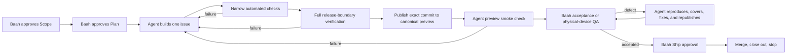

# Bounded Autonomous Delivery Design

**Status:** Proposed
**Last updated:** 2026-10-08

## Purpose

Taisa delivery should require Baah for product authority and physical judgment, not for routine testing, repair, tracking, or coordination. The current persistent Product and Linear goals overlap ownership, repeatedly reconcile global state, poll long-running checks, and create adjacent work while the approved work is waiting. This design replaces that pattern with one accountable, issue-bounded conductor.

Success means the agent can take one approved issue from Plan approval through implementation, automated repair, canonical preview, and QA readiness without asking Baah to keep saying “continue.” Baah enters at material Scope and Plan decisions, unavoidable physical-device questions, final acceptance QA, and Ship.

## Approaches considered

### 1. Two persistent specialist loops

Keep separate Product and Linear loops but narrow their prompts. This preserves specialization, but both still need overlapping Git, issue, approval, and preview context. Coordination cost and ownership ambiguity remain. Rejected.

### 2. One permanent product-completion loop

Use one agent to continuously select and deliver work until the full product ships. This removes duplication, but the goal is too broad and long-lived. It encourages stale context, uncontrolled work-in-progress, opportunistic work during waits, and expensive global reconciliation. Rejected.

### 3. One issue-bounded conductor with event-based resumption

Run one conductor for one approved delivery slice. It owns implementation and housekeeping inside that boundary, becomes dormant at genuine gates or external waits, and stops after Ship/closeout rather than selecting the next issue. This preserves useful autonomy without continuous activity. Recommended.

## Operating model

Each delivery cycle has exactly one primary Linear issue and one accountable conductor. The issue supplies the approved outcome, stage, acceptance criteria, dependencies, and evidence. Git supplies versioned technical truth. The conductor may maintain Linear, Git, GitHub, documentation, tests, preview state, and review evidence only for the active issue and its approved sub-issues.

The normal lifecycle is:

The conductor does not select a new issue after closeout. Baah begins the next cycle or explicitly authorizes a named milestone batch.

## Work-in-progress boundaries

- One active implementation issue at a time.
- At most one discovery-only issue may coexist when it has no overlapping files, decisions, dependencies, or approval path.
- No new Scope, Plan, bug, cleanup, or documentation initiative merely because CI, a device check, or Baah is unavailable.
- Newly discovered adjacent work is recorded once in Linear and left unstarted unless it blocks the active acceptance criteria.
- A blocker may justify a bounded repair inside the same approved outcome. A materially different outcome returns to Scope.
- The conductor cannot coordinate, resume, or redirect another Codex chat unless Baah explicitly authorizes that action.

## Agent-owned verification and repair loop

After Plan approval, the conductor owns the complete machine-verifiable loop:

1. Implement the smallest coherent increment.
2. Run the narrowest relevant unit, contract, integration, simulator, UI, accessibility, and static checks.
3. Diagnose failures and repair them without requesting routine direction.
4. Add regression coverage when practical and proportionate.
5. Repeat affected checks until green.
6. Run the complete applicable verification matrix once the candidate is stable.
7. Resolve blocking code-review findings and repeat affected checks.
8. Commit the exact verified revision.
9. Integrate and push that revision to `preview/taisa` when device-facing.
10. Confirm the preview runtime or installed build identifies that exact revision.
11. Perform all available simulator and preview smoke checks before involving Baah.

A successful compile is not QA readiness. A transient failure is not a reason to ask Baah to test. The agent continues until the failure is resolved, an approval boundary is reached, or a genuine external blocker is proven.

## Baah QA contract

Baah QA happens only after agent-owned verification is exhausted and an exact-revision candidate is ready. It is acceptance and physical-perception testing, not routine defect discovery.

Baah is asked to assess only matters the agent cannot establish reliably through code, automation, simulators, logs, or preview inspection, including:

- whether the journey solves the intended product problem;
- physical microphone, audio routing, haptics, permissions, and device performance;
- perceptual animation, comfort, clarity, and interaction quality;
- behavior with Baah's real data when privacy prevents agent inspection.

An earlier physical-device checkpoint is allowed only when a named hardware uncertainty blocks further implementation. The request must identify the exact revision, action, expected observation, and decision unlocked.

When Baah reports a defect, the conductor owns the repair cycle: verify preview authority, reproduce, add coverage where possible, fix, run narrow and required full checks, republish the exact revision, and smoke-test it. Baah retests only the failed behavior and materially affected journey. The conductor must not repeatedly return partially verified revisions.

## Waiting and resumption

Waiting is a state, not work. At CI, approval, device, credential, or external-service waits, the conductor records one concise checkpoint and becomes dormant.

- Do not consume full reasoning turns to poll unchanged state.
- Prefer completion notifications or a scheduled check near the expected terminal time.
- For unavoidable polling, use one lightweight check no more frequently than the known normal duration warrants.
- Do not reread global workflow, all milestones, all worktrees, or unrelated chats when the active issue and relevant revisions have not changed.
- Resume only on meaningful state change, Baah input, terminal check result, or an explicitly scheduled bounded wake-up.
- Unchanged state produces no Linear comment and no user notification.

## Orientation and tracking cost

Orientation is incremental. At cycle start, perform the full required reconciliation for the active issue. During the cycle, re-check only state that could have changed since the last checkpoint. Full orientation repeats only when the issue, branch, worktree, approval evidence, dependency, preview revision, or remote state materially changes.

Linear records material transitions and durable evidence. It does not receive commentary for every command, retry, poll, or passing narrow test. Required updates are limited to:

- Scope and Plan approval evidence;
- Build start and material blocker changes;
- candidate commit and relevant verification summary;
- canonical preview revision and QA request;
- QA failure and verified replacement revision;
- Ship approval, merge SHA, accepted deferrals, and closeout.

## Verification layering

Verification cost follows risk:

- **During Build:** targeted tests and checks for changed behavior.
- **Stable candidate:** complete applicable local verification matrix.
- **Pull request:** hosted checks required by branch protection; do not duplicate unchanged local work without a stated reason.
- **Canonical preview:** exact-revision smoke checks and any device-sensitive automated checks.
- **Baah QA:** product acceptance and irreducibly physical judgment.
- **After a defect:** narrow regression loop first; rerun the complete matrix only when the change or release policy requires it.

## Goal and orchestrator changes

Implementation of this design will:

- retire the overlapping Product-development and Linear-orchestration goal definitions;
- replace them with one reusable, issue-bounded delivery goal template;
- remove instructions to select the next issue automatically after completion;
- prohibit opportunistic adjacent work while waiting;
- add explicit dormant and event-resumption states;
- distinguish agent-owned QA from Baah acceptance QA;
- make incremental orientation the default within a stable cycle;
- constrain Linear updates to material events;
- encode the work-in-progress limits and verification layers in `docs/workflow.md`, `AGENTS.md`, `CLAUDE.md`, and the Taisa orchestrator skill;
- add workflow verification checks for the new invariants.

Existing active work, branches, worktrees, approvals, and Linear history will be preserved. The redesign changes how future work advances; it does not silently approve, merge, delete, or restart current work.

## Failure handling

- If automated checks cannot reproduce a physical failure, confirm exact preview authority and request one narrowly instrumented device observation.
- If CI exceeds its established duration, inspect once for a stuck runner or infrastructure failure; do not restart a healthy run.
- If a repair changes acceptance criteria, architecture, security, privacy, persistence, public contracts, or verification responsibility, return to the applicable Baah gate.
- If the active issue is blocked but unrelated work exists, stop. Starting different work requires a new explicit cycle or milestone-batch authorization.
- If Linear is unavailable, continue only already-approved work supported by durable evidence; do not infer a new stage or approval.

## Acceptance criteria

- Exactly one goal owns an active delivery cycle.
- The goal is bound to a named Linear issue, milestone, approved Scope, approved Plan, branch/worktree, completion condition, and next Baah gate.
- No loop automatically selects adjacent or successor work.
- The agent autonomously repairs all machine-verifiable failures inside approved scope.
- Unchanged CI or external state does not generate repeated reasoning turns, comments, or notifications.
- Baah receives a QA request only for an exact, fully verified canonical-preview revision or a documented blocking hardware uncertainty.
- A QA defect triggers an agent-owned reproduce/fix/verify/republish loop before Baah is asked again.
- Linear receives material evidence and transitions rather than command-level narration.
- Full orientation is not repeated during a stable issue cycle without a material state change.
- Current work and history remain preserved while the old loops remain paused.

## Non-goals

- Removing Scope, Plan, physical QA, or Ship authority from Baah.
- Weakening migration, privacy, security, accessibility, or release verification.
- Allowing unattended merges or destructive cleanup.
- Replacing Linear as the live delivery authority.
- Automatically resuming the paused goals before the new goal is reviewed and explicitly activated.
