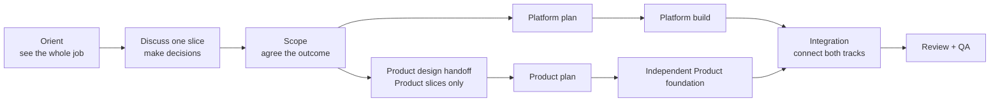

# Taisa Build Workflow

**Status:** Active
**Last updated:** 2026-10-07

How work moves from idea to shipped. Read this at the start of every feature session.
Claude maintains the Active Work table — Baah never needs to update it.

After this file and the Taisa workflow orchestrator, read `docs/project-memory.md` and
then load only the accepted decisions, reusable learnings, and canonical domain documents
relevant to the task.

---

## Workflow activation

### Activation bias

Default toward activating the workflow. If Baah's message can reasonably be read as asking
to change, investigate, design, scope, plan, fix, review, validate, or ship Taisa—including
its product, Platform, design system, documentation, or operating process—the agent performs
workflow orientation and assigns the lightest fitting tier. Baah does not need to use workflow
keywords. Activation starts orientation; it does not authorize Build, bypass gates, or expand
the requested outcome.

| Request signal | Treatment |
|---|---|
| Concrete problem, desired behavior, or requested change | Activate workflow; infer the lightest fitting tier |
| Ambiguous but plausibly change-oriented | Activate lightweight orientation; clarify only if a decision would materially change the result |
| Explicitly read-only explanation or status question | Orient and answer; create no branch or workflow artifact |
| Explicitly future, speculative, or “park this” idea | Add to backlog and stop unless Baah also asks to explore or advance it |

Missing words such as “feature,” “scope,” or “plan” never downgrade an actionable request to
a backlog idea. When classification remains uncertain after orientation, prefer activation.

**Explicit precedence:** requested action or advancement activates; an explicit
“park this” or “backlog only” instruction with no advancement stays in the backlog; a purely
read-only request receives only orientation and an answer; anything still ambiguous defaults
to lightweight activation.

---

## Active work

| Feature | Track | Stage | Branch | Blocked on |
|---|---|---|---|---|
| Local-first coaching platform | Platform | Build | `feature/local-first-coaching-platform` | Managed-device recovery/privacy QA is next; paid live provider evaluation remains gated; legacy-route retirement requires later explicit approval |
| Personal alpha release | Platform + Product | Build | `feature/local-first-coaching-platform` | Code-only build complete at `850b3d6`; next gate is Baah approval to create Railway resources, add billing/secrets, and deploy. Signed iPhone installation follows as a separate gate. |
| Post-Send streaming transcription | Platform + Product | Review + QA | `feature/local-first-coaching-platform` | Managed-device clear/uncertain/no-speech calibration before Ship approval |
| Taisa system architecture | Platform | Review + QA | `docs/reimagine-product-scope` | Baah document review |
| Secondary icon button | Product | Review + QA | `feature/secondary-icon-button` | Baah device QA |
| Recording page | Product | Review + QA | `feature/secondary-icon-button` | Baah device QA |
| Shared chat and recording shell | Product | Build | `codex/chat-close-auth-handoff` | Baah paired-device QA after preview integration |
| Glass elevation, alignment, and interaction feedback | Product | Review + QA | `fix/glass-elevation-keyboard-surfaces` | canonical preview integration + Baah device QA |
| SwiftUI native rebuild | Platform + Product | Shipped | `main` | — |
| Swift native encrypted storage, sync, and recovery | Platform | Review + QA | `feature/swift-native-encrypted-sync` | Baah Ship approval; live CloudKit remains blocked on paid Apple Developer Program membership and production schema promotion remains unapproved. |

---

## Feature tiers

Not every feature needs the full workflow. Claude assesses tier at task start and states it.

| Tier | Signal | Process |
|---|---|---|
| **Quick** (< 1h) | Single change, no new DS components, no Platform work | No formal Work Map or scope doc. State intent and impact, build, and QA. Add a compact diagram only when architecture, data flow, or behavior changes. |
| **Standard** (half day) | New screen or significant component, existing DS only | Inline Work Map + Discussion Map, then separate Scope and Plan approvals. Linear issue after Scope approval. |
| **Full** (multi-day / multi-track) | New Platform work, new DS components, or complex Product | Full workflow — all stages, all gates, all Linear tracking. |

Baah can override: "treat this as Quick" or "go Full on this."

---

## The Two Tracks

**Platform** — AI, backend, infrastructure, persistence, and contracts. Runs one phase ahead of Product.
**Product** — UI, screens, components, interaction, and device experience.

**Integration** is not a third track. It is the shared responsibility that proves Platform
contracts and Product behavior work together before REVIEW + QA. Cross-track features are
decomposed into distinct Platform and Product slices, then reunited by Integration slices.

**Design System** is not a separate track. It is a mandatory foundation layer inside every
Product BUILD — confirmed at PLAN, built first during BUILD, ships in the same PR.



---

## The Six Stages

```
ORIENT → DISCUSS → SCOPE → PLAN → BUILD → REVIEW + QA
```

Product experience requirements are decided during DISCUSS and captured in SCOPE. Product
slices add a conditional design handoff between Scope approval and Plan; Platform slices
proceed directly from Scope to Plan.

### 1. Orient

Before detailed discussion or planning, show the complete feature as a Work Map.

### Work Map

Every Standard or Full Work Map contains a linked table of contents for every slice; one
owner per slice (Platform, Product, or Integration); outcome, dependency, approval point,
and relative size (`XS / S / M / L / XL`); recommended pickup order, parallel opportunities,
critical path, progress counters, and a high-level architecture diagram. Add a rough pace
forecast only after repository inspection and label it as an estimate.

Full Work Maps live at `docs/features/<name>-work-map.md`. Standard maps may be inline. A
Work Map is orientation, not an approval gate or implementation plan.

**Entry:** an idea is promoted for scoping. **Exit:** every known slice has one owner, size,
dependency, and pickup order; decomposition-changing unknowns are explicit.

### 2. Discuss

Select one slice and show its Discussion Map before the first substantive question. Keep
`current / next / remaining decisions` visible.

### Discussion Map

| Slice owner | Required discussion coverage |
|---|---|
| Platform | User outcome; current system; ownership and persistence; core behavior; Product contract; privacy/security; failure and recovery; dependencies; validation |
| Product | User outcome; journey and information priorities; required states; interaction intent; accessibility needs; Platform capability; device-QA expectations. Do not map components, tokens, or exact layouts here. |
| Integration | Contract compatibility; end-to-end data flow; cross-track states and failures; preview strategy; combined verification; release readiness |

**Entry:** a slice is selected from an exit-ready Work Map. **Exit:** required decisions are
resolved or explicitly deferred, open questions have an owner, and the diagram matches the
agreed understanding.

### Architecture diagram contract

Diagrams communicate **layman meaning and technical truth** in the same view. Primary labels
explain product meaning; secondary labels name the real service, store, component, route, or
boundary. Arrows describe the information or control that moves. Show relevant ownership,
storage, trust, failure, and offline boundaries. Mermaid is the editable default. Update a
diagram in the same change as the architecture or dependency it describes.

Every Full Work Map, scope, and plan overview includes an appropriate architecture diagram.
Standard work includes one unless one sentence fully expresses the relationship. Quick work
follows the tier rule above.

### 3. Scope
**Who:** Baah (product decisions) + Claude (`scope-writer` skill)
**Output:** Scope doc in `docs/features/<name>.md` (Full tier) or inline note (Standard)
**Auto-chain:** After scope agreed → Platform: `writing-plans` fires. Product: Claude prompts for design.

Scope doc format:
- Work Map link or inline summary
- Discussion decisions and unresolved questions
- Layman-plus-technical architecture diagram
- What is it?
- Why now?
- Acceptance criteria (checkboxes — observable behaviour, not implementation)
- Platform dependencies (Product features only)
- Out of scope

A feature is not ready to plan until its scope is written and agreed.

**Entry:** the selected slice completed DISCUSS. **Exit:** acceptance criteria, exclusions,
dependencies, architecture, and unresolved questions are explicit; Baah approves Scope.

#### Product design between Scope and Plan
**Who:** Baah (provides design) + Claude (`design-handoff` skill)
**Applies to:** Product track only.
**Auto-chain:** When Baah shares any design reference → `design-handoff` fires → brief produced → `writing-plans` fires automatically after brief confirmed.

The Product Discussion Map decides what experience and states are required. The design
handoff supplies how those decisions map to layouts, components, tokens, and interaction
evidence. Material differences return to Scope for reapproval.

Three design paths — same `design-handoff` process, same brief output:

| Path | Trigger | Implementation latitude |
|---|---|---|
| Figma / screenshots | Baah shares Figma URL or exported image | Highest precision |
| Sketch | Baah shares sketch photo or scan | Directional — DS tokens fill gaps |
| Visual Companion | Brainstorming session ends with agreed mockups | Most directional — device QA is real sign-off |

Minimum design handoff (all paths):
- Layout intent for all screens in the flow (happy path + key error/empty states)
- Component states (default, active, disabled, empty) — even just described in words
- Which DS tokens apply (or note that tokens are TBD)
- Interactions that affect build decisions (gestures, animations)

### 4. Plan
**Who:** Claude (`writing-plans` skill) + Baah (approves summary)
**Output:** Implementation plan in `docs/superpowers/plans/<name>.md`
**Auto-chain:** After Baah approves plan summary → BUILD starts.

Every plan overview begins with the slice's place in the Work Map, dependency path, and an
updated layman-plus-technical diagram. Material changes return to DISCUSS or SCOPE.

Every Product plan includes a DS components section (sourced from the design-handoff brief):
- Existing DS components (reuse, no build needed)
- New DS components (confirmed by Baah at plan approval)

**Platform dependency check:** Before writing a Product plan, Claude verifies Platform
dependency stage. If not yet in BUILD:
- **Wait** → feature stays in SCOPE
- **Skeleton** → independent Product foundation slices (DS + layout + mock data) may be
  planned and built after Product Plan approval. Contract wiring and live-data integration
  remain `[BLOCKED: needs <Platform feature> in BUILD]` until the contract is ready.

**Entry:** Scope is approved; Product also has a confirmed design handoff. **Exit:** tasks,
tests, dependencies, integration points, and verification are complete; Baah approves Plan.

### 5. Build
**Who:** Claude (`executing-plans` skill, `dispatching-parallel-agents` if multi-track)
**Input:** Approved plan + design reference
**Output:** Working code, committed to `feature/<name>`

**DS build order (strict — never deviate):**
1. DS layer → `mobile/src/components/ui/` (NativeWind, typed props, no business logic)
2. Screen layer → imports only from `mobile/src/components/ui/`, no inline primitive styles

For the approved SwiftUI native-rebuild program, the equivalent order is:
1. Native DS layer → `apple/DesignSystem/` (typed semantic tokens and components, no business logic)
2. Native feature layer → consumes `apple/DesignSystem/`; raw visual values require a documented, verified exception

**Token check before BUILD:**
- Tokens defined → proceed normally
- Tokens partial → proceed, mark gaps `// TOKEN-TBD: needs <value>`, refine at REVIEW
- No tokens at all → flag to Baah, get explicit go-ahead before building

**Mid-build DS discovery:** Component found that should be in DS but wasn't in the plan:
- No existing usage affected → move to DS immediately, note in commit message
- Moving it affects already-built screens → finish inline, flag at REVIEW for extraction

Platform and independent Product foundation slices may proceed in parallel. Integration
slices start only when the named Platform contract and Product consumer are ready. Report
`overall / Platform / Product / Integration` slice counts and the next pickup.

**Entry:** the relevant Plan is approved and dependencies are ready. **Exit:** behavior is
implemented, narrow checks pass, diagrams match, and Integration is proved where applicable.

### 6. Review + QA
**Who:** Claude (`requesting-code-review` + `verification-before-completion`) + Baah (device QA)

**Canonical React Native preview:** Only Metro started from `.worktrees/preview-taisa/mobile` on `preview/taisa` may own port `8082` for React Native device QA. Before Baah is asked to device-QA any React Native feature, integrate that feature's committed work into `preview/taisa`; feature worktrees remain isolated implementation environments and are not device-QA targets.

**Canonical native Apple preview:** SwiftUI device feedback is authoritative only from a signed build record containing the native Git commit, Xcode build number, bundle identifier, distribution/TestFlight version, backend environment, database schema version, parity-catalog revision, and confirmation that the tested device installed that exact build. A simulator, Xcode Preview, or feature worktree is not a device-QA target.

Signed native records are stored in `docs/migration/swiftui/native-builds.md` and validated by `apple/scripts/record-signed-build.mjs`. Development, preview, and Personal builds use isolated bundle identifiers and must never replace the production React Native app during migration. A Personal Team refresh installs over the existing `com.taisa.app.personal` identity; it never uninstalls that identity because its encrypted store is device-local. Personal file transfer is an explicit encrypted replacement from one authoritative device, not synchronization or history merging.

**Verification matrix:**

| Change area | Required checks |
|---|---|
| Backend | Backend Jest suite + backend TypeScript build |
| Shared types | Shared type-check/build + affected backend tests |
| Mobile logic | Mobile TypeScript check + relevant available tests |
| Mobile UI | Mobile TypeScript check + DS compliance + relevant Storybook checks + device QA |
| Native Apple logic | Swift build + relevant Swift Testing/XCTest suites |
| Native Apple UI | Swift build + native DS compliance + preview/snapshot checks + exact signed-build device QA |
| Native Apple cross-stack | Backend tests/build + shared contract fixtures + Swift build/tests + exact signed-build device QA |
| Cross-stack | Backend tests/build + shared checks + mobile TypeScript check |
| Docs/workflow | Path/link consistency + workflow verification + clean diff |

Run the narrowest relevant check throughout BUILD, then run the complete applicable row before PR or Ship. Missing test infrastructure is a reported gap, not a passing test. Mobile-facing changes require Baah's device QA unless explicitly classified as non-visual and non-device-sensitive.

**DS compliance check (blocks PR if any fail):**
- [ ] All visual primitives in screens import from `mobile/src/components/ui/`
- [ ] No `StyleSheet.create()` in new or changed files
- [ ] New DS components: typed + exported props, documented in `docs/design-system.md`
- [ ] No business logic inside DS components

**Native Apple DS compliance check (blocks PR if any fail):**
- [ ] Product views consume typed components/tokens from `apple/DesignSystem/`
- [ ] Raw visual values have a narrow documented exception and verification coverage
- [ ] New native DS components expose typed semantic APIs and preview states
- [ ] No business logic, networking, persistence, or navigation inside native DS components

**If build fails QA:**
1. Baah notes specific failures in chat.
2. Claude creates or updates one Linear issue per distinct failure, including the observed preview revision, reproduction context, severity, and acceptance criteria; the issue is linked to the feature work.
3. Active Work reverts to Build for release-blocking failures. Non-blocking failures remain prioritized Linear work and require Baah's explicit acceptance if the feature proceeds to Ship with them unresolved.
4. Claude fixes selected issues, comments verification evidence on the Linear issue, reruns `verification-before-completion`, and re-raises for QA.

QA documents may retain immutable verification history and device checklists, but they are not the active bug queue. Current status, discussion, ownership, and resolution live in Linear.

A feature is not merged until both checks pass.

**Entry:** Build exit criteria and applicable Integration slices are complete. **Exit:** the
verification matrix and required QA pass, review findings are resolved, and Baah grants Ship.

### Memory promotion and closeout

During Review and again before Ship, classify non-routine context using this routing:

```text
Feature-specific context -> scope, plan, QA note, or PR
Reusable evidence -> docs/learnings.md
Accepted cross-cutting choice -> docs/decisions/
Current-behavior change -> canonical domain document
```

Conversational BTS notes are optional and skippable. The memory-promotion check is not:
it runs even when BTS is skipped. Link between destinations instead of duplicating long
explanations.

Every Standard and Full scope or plan receives a `Closeout` section during Review with:

- Actual outcome
- Plan deviations
- Learnings and decisions
- Remaining debt
- Canonical docs updated
- PR and merge evidence

Quick work records material closeout in its PR description or final commit. Closeout is
agent-owned housekeeping within the existing approvals; it does not add another gate.

---

## DS update rules

**Feedback routing — where changes land:**
```
Feedback touches a DS component or token?
  YES → update mobile/src/components/ui/<Component>.tsx + docs/design-system.md
        change propagates to every screen that uses it
  NO  → update the screen directly (layout, positioning, screen-specific logic)
```

**DS update threshold:**
| Change type | Action |
|---|---|
| New variant / backwards-compatible prop | Autonomous — add it, document it |
| Behaviour change affecting all usages | Surface to Baah: "This changes [X] everywhere — confirm?" |
| Breaking change (removed prop, renamed export) | Always ask — show all usages and impact |

---

## Idea backlog

Before a feature enters the workflow, it must be captured.

**Trigger:** Baah mentions a new idea, improvement, or "we should…" in any session.
**Claude's response:** One line added to `docs/backlog.md`. Confirmed in chat. Nothing else.

Linear issues are created only when a Backlog item enters active scoping.
To promote: "let's scope [idea]" → Claude checks Linear for existing Backlog issue first.
To batch sync: "sync the backlog" → Claude creates Linear issues for all unsynced rows.

---

## Parked features

Feature deprioritised mid-pipeline:
- Active Work table → remove row
- Linear → Canceled, comment with reason
- Branch preserved (do not delete)
- Work Map, scope doc, handoff, and plan are preserved and marked `Status: Parked`

---

## Document conventions

| Document | Location | Written by |
|---|---|---|
| Project memory index | `docs/project-memory.md` | Claude (links and authority map) |
| Decision records | `docs/decisions/NNNN-<name>.md` | Baah + Claude (approval rules apply) |
| Reusable learnings | `docs/learnings.md` | Claude (evidence-backed, append-only) |
| Roadmap | `docs/roadmap.md` | Both — kept current |
| Backlog | `docs/backlog.md` | Claude (auto-maintained) |
| Full-tier Work Maps | `docs/features/<name>-work-map.md` | Claude + Baah |
| Scope docs | `docs/features/<name>.md` | Claude + Baah |
| Implementation plans | `docs/superpowers/plans/<name>.md` | Claude |
| Design system | `docs/design-system.md` | Baah + Claude (DS components) |
| API reference | `docs/api.md` | Claude (updated on every route change) |
| Workflow | `docs/workflow.md` | Claude (Active Work table) + Baah |
| QA evidence | `docs/features/<name>-qa.md` | Claude (verification history only; active bugs live in Linear) |
| Work closeout | Standard/Full scope or plan | Claude (completed during Review and Ship) |

**Skills invoked per stage:**
| Stage | Skill |
|---|---|
| Orientation + discussion | `taisa-workflow` + `brainstorming` |
| Scoping | `scope-writer` |
| Product design handoff | `design-handoff` |
| Planning | `writing-plans` |
| Building | `executing-plans` / `dispatching-parallel-agents` |
| Review | `requesting-code-review` + `verification-before-completion` |
| All of the above | `taisa-workflow` (master orchestrator — read at session start) |

---

## Documentation freshness cadence

Documentation updates are event-driven, not calendar-driven. At session start, compare every
in-scope artifact with the current branch, Active Work, code, and remote state. Standard and
Full Work Maps, scopes, plans, and handoffs carry `Status` and `Last updated: YYYY-MM-DD`.

| Artifact | Update timing |
|---|---|
| Active Work | Every stage, blocker, branch, and session-handoff change |
| Work Map | Every slice, owner, size, dependency, order, critical-path, architecture, or progress change; review before selecting the next slice |
| Discussion decisions | When made, deferred, reopened, or assigned |
| Scope | At approval and whenever outcome, acceptance criteria, exclusions, dependencies, or architecture change; material changes require reapproval |
| Design handoff | In the same change as a revised screen, state, interaction, component classification, or token decision |
| Plan | At approval, task/dependency status changes, or discoveries changing the build path; material changes require reapproval |
| API, data model, design system, and standalone architecture references | In the same implementation change that alters their contract or behavior |
| QA evidence | Every failed-QA and fix/retest cycle |
| Roadmap and Linear | Every defined phase, priority, dependency, or status event |

Architecture diagrams are embedded content owned by their **host artifact**. The host
artifact's cadence applies; update diagrams in the same change as the architecture, data flow,
ownership, state, dependency, or failure boundary they describe.

### Canonical documentation authority

- Proposed documentation belongs to the work branch owning the slice.
- `main` becomes canonical only after approval and merge; `preview/taisa` is never canonical documentation.
- Active Work identifies the owning branch while work is in flight.
- When branches overlap an artifact, reconcile against `origin/main` and the owning branch before the next gate. Stop if authority cannot be established.

### Material change and reapproval

A **material change** alters outcome, acceptance criteria, exclusions, user-visible behavior,
architecture boundary, public contract, persistence/ownership, dependency order,
security/privacy, verification strategy, or approval responsibility. Return to Scope or Plan.
Typos, formatting, unchanged-meaning clarification, evidence links, counters, and status-only
updates are non-material.

### Superseded documents

Mark obsolete artifacts `Status: Superseded`, add `Superseded by: <path or merge SHA>`,
update Work Map and roadmap references, and retain history unless Baah approves deletion.

### Freshness verification

Before Scope, Plan, or Ship gates, run:

```bash
bash scripts/verify-doc-freshness.sh <affected-work-map-or-scope-or-handoff-or-plan> [...]
```

Metadata validation supplements the semantic comparison against code and branch state. Stale
documentation blocks a gate when it could misstate scope, architecture, dependencies,
verification, or shipped behavior.

---

## Gate definitions

| Gate | Artifact | Baah signal |
|---|---|---|
| Scope agreed | `docs/features/<name>.md` exists | Any approval intent |
| Plan approved | `docs/superpowers/plans/<name>.md` exists | Any approval intent |
| Ship | Code review + verification passed | Baah confirms device QA in chat |

Claude reads intent, not keywords. Ambiguous → one yes/no question.

---

## Git and shipping

### Canonical branch

`main` is the only permanent branch and the only shipping branch. It is the GitHub default and the base for every pull request. `preview/taisa` is the integration-only branch for combined phone previews; it is never a shipping base and must not be merged to `main` as part of device-QA setup. Platform and Product are workflow tracks, not Git branches; there is no long-lived `develop` branch.

### Branch naming

Every work branch uses `<type>/<short-kebab-case-description>`.

| Prefix | Use |
|---|---|
| `feature/` | New user-facing capability |
| `fix/` | Defect correction |
| `chore/` | Tooling, dependencies, configuration, and maintenance |
| `docs/` | Documentation-only changes |
| `refactor/` | Internal restructuring with no intended behavior change |
| `test/` | Test-only work |
| `spike/` | Disposable investigation; promote before merging or delete explicitly |

Names are lowercase kebab case and describe one deliverable. Do not use agent/person namespaces, generic names, needless nesting, or combine unrelated scopes.

### Branch creation and commits

Codex owns branch setup: confirm a clean worktree, fetch and prune, fast-forward local `main`, create the typed branch from `main`, then update Active Work for Standard and Full work. Feature development never starts directly on `main`.

Commits use `feat:`, `feat(ds):`, `fix:`, `fix(ds):`, `test:`, `docs:`, `refactor:`, or `chore:` and contain one coherent change. Work-in-progress commits may exist on the work branch because squash merge is standard.

### Pull requests and merge

- Create the PR after applicable local checks pass, not before.
- Target `main`; link scope/spec/plan artifacts, list acceptance criteria, and include verification evidence.
- Resolve blocking review findings and complete required device QA before Ship.
- Squash merge by default with a conventional commit title. Merge commits and rebase merges require a stated reason.
- Do not push feature development directly to `main`, force-push, or rewrite shared history without separate explicit approval.

### Ship gate

Clear Ship approval such as “ship it” or “merge it” authorizes Codex to perform this complete transaction without repeated prompts:

1. Confirm the feature branch and worktree are clean.
2. Fetch and confirm the branch is current with `origin/main`, or reconcile it safely.
3. Run the complete applicable verification matrix.
4. Run final code review and confirm there are no blocking findings.
5. Confirm required device QA has passed.
6. Push the work branch.
7. Create or update its pull request.
8. Squash-merge the PR into `main`.
9. Fast-forward local `main` to `origin/main`.
10. Verify local `main`, remote `main`, the PR, and the merge SHA agree.
11. Delete the merged remote work branch.
12. Delete the merged local work branch from another checked-out branch/worktree.
13. Prune stale remote refs and remove disposable worktrees when safe.
14. Update Active Work, roadmap/plan status, and Linear with the merge SHA.
15. Report verification evidence and final branch state.

Ship approval does not authorize force-pushes, history rewrites, deletion of unmerged work, or removal of unrelated worktrees. Stop cleanup and report the exact blocker if the tree is dirty, checks fail, conflicts exist, a branch contains unaccounted unique commits, another worktree owns it, the PR targets an unexpected base, or remote state cannot be verified. Never force-delete a branch merely because its name looks obsolete.

---

## Roadmap hygiene

- Roadmap updated when a feature changes phase
- Active Work table in this file updated at every stage transition (Claude owns this)
- Scope docs for the next phase written while current phase is in Build
- If a dependency slips, the blocked feature stays in its current phase
