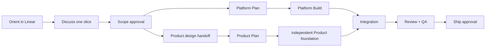

# Taisa Build Workflow

**Status:** Active
**Last updated:** 2026-10-09

How Taisa work moves from intake to shipped. Linear is the sole live authority.
Linear project `Taisa`
(`31b0d99c-6f74-4c9c-af2a-12e6e25aabe0`) is the sole live authority for roadmap
milestones, actionable task intake, priority, ownership, stage, dependencies, blockers,
Scope, Plan, acceptance, discussion, and gate evidence. The repository owns only operating
constraints, architecture and public contracts, durable decisions, migrations, and
verification evidence that must version atomically with code.

Read [`docs/project-memory.md`](project-memory.md) during orientation and then load only the
domain documents relevant to the active Linear issue.

## Workflow activation

### Activation bias

Default toward activation. A concrete change, investigation, design, scope, plan, fix,
review, validation, delivery, or process improvement activates the workflow and the
lightest fitting tier. Activation never authorizes Build or bypasses Scope, Plan, or Ship.

**Explicit precedence:** requested action or advancement activates; explicit future-only
direction is recorded in the relevant Linear milestone until someone owns actionable work;
a purely read-only/status request receives orientation and an answer only; anything still
ambiguous receives lightweight orientation.

Every actionable task receives a non-duplicate Linear issue before investigation, design,
planning, implementation, documentation, review, release work, chores, or work Baah will
perform. Read-only questions and orientation commands within an existing issue are the only
exceptions. Search exact and semantic matches, including archived work, before creation.

## Cycle orientation

At the start of one approved delivery cycle, before modifying product or workflow state:

1. Read the Taisa Linear project, six milestones, active issues, dependencies, blockers,
   priorities, recent updates, Scope/Plan evidence, and approval comments.
2. Read `AGENTS.md`, this file, `.agents/skills/taisa-workflow/SKILL.md`, and
   `docs/project-memory.md`.
3. Inspect the current branch, worktree, all relevant worktrees, remote tracking, exact
   commits, tests, PRs, canonical preview revision, and related active delivery chats.
4. Reconcile contradictions before modifying product code or advancing a stage.
5. State tier, Linear issue and milestone, stage, branch/worktree, blocker/dependency, next
   action, next Baah gate, and whether Linear was unavailable or contradictory.

Within a stable cycle, orientation is incremental. Re-read only state whose issue, approval,
dependency, branch/worktree, PR, CI, preview, or remote revision changed since the last
checkpoint. Do not reread all milestones, worktrees, or related chats when their relevant
revision markers are unchanged.

### Offline fallback

If Linear is unavailable, continue only already-approved work whose current Scope and Plan
are available in recent trusted context and supported by Git evidence. Do not create a new
actionable task, infer a stage transition, change a blocker, or claim approval while Linear
is unavailable. Record evidence locally only when it must version with code, then reconcile
Linear before the next stage or gate.

### Contradiction repair

- Linear owns live stage, priority, owner, dependencies, blockers, Scope, Plan, acceptance,
  discussion, and gate evidence.
- Git owns code, branch/commit identity, versioned architecture/public contracts, durable
  decisions, migrations, and code-coupled verification evidence.
- A Linear status cannot override missing approval evidence or a Draft technical artifact.
- When the systems disagree, stop advancement, identify the stale side, repair it within
  existing authority, and re-read both. Never invent missing approval.

## Feature tiers

| Tier | Signal | Process |
|---|---|---|
| **Quick** (< 1h) | One bounded change, no new DS component or Platform boundary | One compact kickoff bundle approves Scope and Plan when no high-risk predicate applies. |
| **Standard** (half day) | New screen or significant component using existing contracts | Inline Work Map and Discussion Map; one kickoff bundle approves Scope and Plan when no high-risk predicate applies. |
| **Full** (multi-day / multi-track) | New Platform work, DS components, migration, or complex Product | Separate Scope and Plan approvals, Linear documents/sub-issues where useful, all gates and tracking. |

### Approval-path decision

The path is deterministic:

| Condition | Approval path |
|---|---|
| Quick or Standard with no high-risk predicate | One explicit kickoff bundle approves Scope and Plan |
| Full | Separate Scope and Plan approvals |
| Any tier with a high-risk predicate | Separate Scope and Plan approvals |
| Baah requests separate review | Separate Scope and Plan approvals |

High-risk predicates are data migration or loss risk; privacy, security, trust-boundary,
regulatory, or consent changes; destructive or irreversible operations; public-contract or
major architecture changes; paid services, credentials, or new external infrastructure;
materially ambiguous product behavior; release-strategy changes; or verification changes
that could weaken an existing safety gate.

For Quick and Standard fast-path work, the kickoff bundle contains the recommended outcome,
user-visible result, inclusions, exclusions, key risks, implementation direction, and
verification approach. During Build, a material change completes the active Goal as
`MATERIAL_REAPPROVAL_REQUIRED`. Present an amended kickoff bundle only when the work remains
Quick/Standard and no high-risk predicate applies; otherwise obtain separate revised Scope
and Plan approvals.

## Platform, Product, and Integration ownership

Platform, Product, and Integration use exclusive ownership: every planned task has exactly
one of those owners. **Platform** owns AI, backend,
infrastructure, persistence, privacy/security enforcement, and Product-facing contracts.
**Product** owns journeys, screens, interaction, accessibility behavior, design-system
foundation/consumption, and device experience. **Integration** owns contract wiring between
completed Platform and Product slices, end-to-end states and failures, canonical preview,
combined verification, and release readiness; it never duplicates capability or experience
implementation owned by the other slices.
Design System is a mandatory foundation layer inside Product work, not a separate track.
Cross-cutting privacy, accessibility, performance, and verification requirements are
acceptance constraints on the owning task, not additional slices. These slices stay inside
one primary Linear issue and one conductor. A sub-issue or separate worktree requires an
independently reviewable outcome, distinct owner, real dependency boundary, or independently
shippable slice, and it cannot create another persistent Goal.



## The six stages

`ORIENT → DISCUSS → SCOPE → PLAN → BUILD → REVIEW + QA`

## Bounded Goal runs

A delivery cycle may use several **bounded Goal runs**, but exactly one Goal may own active
execution. A Goal never stays active solely to wait for Baah, CI, a device, or an external
service.

- Intake and approval preparation happen in ordinary chat; no continuous Goal runs while
  Baah decides.
- A Build Goal starts after kickoff-bundle approval or separate Plan approval. It terminates
  at `QA_READY`, `UNRESOLVED_ESCALATION`, `MATERIAL_REAPPROVAL_REQUIRED`,
  `NON_DEVICE_SHIP_READY`, or `EXTERNAL_WAIT_RECORDED`.
- A repair Goal stays on the same Linear issue and terminates at `QA_READY`,
  `UNRESOLVED_ESCALATION`, `MATERIAL_REAPPROVAL_REQUIRED`, or
  `EXTERNAL_WAIT_RECORDED`.
- A Ship Goal starts only after clear Ship approval and terminates after verified merge,
  safe cleanup, evidence update, and next-outcome recommendation.
- A completed Goal never auto-restarts, infers approval, or selects successor work.

Prefer event-capable waits that return on terminal change without repeated reasoning. When
none exists, record `EXTERNAL_WAIT_RECORDED`, complete the Goal, and use one scheduled or
user-triggered continuation near the normal completion window. Unchanged state produces no
reasoning turn, Linear comment, or user notification.

### Work Map

Before detailed discussion for Standard and Full work, store or link a Work Map in Linear.
It includes a table of contents, one Platform/Product/Integration owner per slice, outcome,
dependency, approval point, size (`XS / S / M / L / XL`), pickup order, parallel work,
critical path, progress counters, and a pace forecast only after repository inspection.

### Discussion Map

After selecting a slice, present its agenda before the first substantive question and keep
`current / next / remaining decisions` visible.

- **Platform discussion:** outcome, current system, ownership/persistence, core behavior,
  Product contract, privacy/security, failure/recovery, dependencies, validation.
- **Product discussion:** outcome, journey/information priorities, states, interaction,
  accessibility, Platform capability, device-QA expectations. Exact layout belongs after
  Scope, between Scope and Plan.
- **Integration discussion:** contract compatibility, end-to-end flow, cross-track states
  and failures, preview strategy, combined verification, release readiness.

### Architecture diagrams

Diagrams communicate **layman meaning plus technical truth**. Primary labels explain user
meaning; secondary labels name real services, stores, components, routes, and boundaries.
Arrows describe information/control; storage, trust, failure, ownership, and offline
boundaries are visible. Mermaid is the default. A diagram is embedded content owned by its
host artifact; update it when the host artifact changes.

### Scope

Scope lives in the Linear issue or attached Linear document and contains outcome, why now,
observable acceptance criteria, dependencies, architecture, unresolved questions, and
exclusions. Baah approves material Scope. Issue creation or a status change is not approval.

### Product design between Scope and Plan

After Product Scope approval, use `design-handoff` for Figma/screenshots, sketch, or a
Visual Companion result. Record layout intent, key states, token/component mapping,
interaction evidence, accessibility, and device-QA expectations in Linear. Material
differences return to Scope.

### Plan

Plan lives in the Linear issue or attached Linear document. It names tasks, tests,
dependencies, interfaces, integration, verification, and for Product work the existing/new
DS components. Baah approves the plain-language Plan summary. A material change to build
path, public contract, persistence, security/privacy, verification, or approval ownership
returns to Plan.

If a Product dependency is not in Build, Baah chooses Wait or an approved skeleton:
independent Product foundation may proceed, while contract wiring remains blocked.

### Build

After Plan approval, set the issue In Progress and use `executing-plans` with TDD where
practical. Use subagents only when Baah explicitly authorizes them and tasks are independent.

Product DS order is strict:

1. DS layer (`mobile/src/components/ui/` for React Native; native design-system package for
   SwiftUI), typed and documented, no business logic.
2. Screen layer imports shared primitives and owns navigation/data/state logic.

For cross-track work, Platform and independent Product foundation may run in parallel.
Integration begins only when both named sides are ready.

### Review + QA

Invoke `requesting-code-review` and `verification-before-completion`. Resolve blocking
findings. Record exact checks, revisions, PR, preview, device observations, remaining risk,
and approval state in Linear.

### Verification economy

Use the smallest applicable verification that can falsify the current change first, then
expand only after focused checks pass or the risk boundary requires it. Reuse fresh evidence
when the code, toolchain, configuration, and covered revision are unchanged; do not rerun an
identical expensive command merely to produce another transcript. Run independent checks concurrently
when they do not share mutable state. The complete release matrix remains mandatory at its
named merge, release, repair-release, or high-risk gate.

Autonomous repair remains outcome-based, not attempt-based. Do not repeat the same failed
approach or unchanged verification. After three materially distinct unsuccessful approaches
without new diagnostic evidence, record `UNRESOLVED_ESCALATION` with the root blocker and
smallest Baah-controlled decision; otherwise continue the repair loop until it is proven.
Unchanged CI, device, or service waits produce no narration or repeated reasoning turns.

| Change area | Required checks |
|---|---|
| Backend | Backend Jest suite + backend TypeScript build |
| Shared types | Shared type-check/build + affected backend tests |
| React Native logic | Mobile TypeScript check + relevant tests |
| React Native UI | Mobile TypeScript, DS compliance, Storybook checks, device QA |
| Native Apple | Applicable package tests, project/contracts/DS verification, target builds, device QA |
| Cross-stack | All affected backend/shared/client checks |
| Docs/workflow | Link/path consistency, workflow verifier, freshness where applicable, clean diff |

Missing infrastructure is a reported gap, never a passing test.

### Initial QA-readiness gate

Before the first Baah QA request, all applicable requirements must pass:

1. Acceptance criteria map to concrete evidence.
2. Narrow and complete applicable verification layers pass on the candidate revision.
3. Blocking review findings are resolved.
4. Required Platform, Product, and Integration slices are complete.
5. Device-facing work is committed, integrated, and pushed to canonical preview.
6. The served or installed build is confirmed as that exact revision.
7. Agent-owned simulator, accessibility, preview, and smoke checks pass.
8. Known limitations and inapplicable checks are explicit and do not contradict acceptance.
9. Linear records the candidate revision, evidence, remaining risk, and exact requested
   observation.

Failure of an applicable item returns to autonomous Build; it never produces partial QA.
Automated/simulator evidence covers every supported configuration in the verification matrix.
Physical QA is requested only for hardware or perceptual judgment that automation cannot
establish. One final interaction may contain separated iPhone/iPad checks without becoming
multiple exploratory rounds.

### One-observation repair quarantine

One Baah defect observation is sufficient. Record the exact preview/build revision and enter
`REPAIR_QUARANTINE`; do not ask Baah to repeat, reconfirm, characterize, or periodically
retest the same defect while engineering evidence is incomplete.

The repair-release gate requires: authority/revision confirmation; stable reproduction,
diagnostic trace, or explicit contract assertion; supported root cause; failing-before and
passing-after evidence where technically possible; the fix; affected integration,
simulator/UI, accessibility, and regression checks; the applicable full release matrix;
resolved blocking review; exact replacement commit integrated and pushed to canonical
preview; confirmed served/installed revision; agent smoke check; and one concise retest
request naming the failure, replacement revision, evidence, action, and expected result.
Every repair-release item must be recorded as passed or explicitly inapplicable with evidence;
silently skipping an item keeps the issue in `REPAIR_QUARANTINE`.

The authoritative sequence is:

`Baah observation → REPAIR_QUARANTINE → repair Goal → reproduce/diagnose → BUILDING → VERIFYING → PUBLISHING → agent smoke check → QA_READY → focused Baah retest`.

If the repair cannot be proven, the issue remains **Unfixed; blocking; unshippable**. It is
not QA-ready, Ship-ready, complete, deferred, or eligible for successor work. Baah receives
only one of two material notifications: `fixed and proven` with one focused retest, or
`still unfixed and genuinely blocked` with evidence, materially different approaches tried,
the recommended redesign/reversion/deferral/capability, consequences, and one smallest
Baah-controlled decision or action.

## Canonical preview and feedback authority

Baah’s UI/mobile feedback is assumed to come from canonical `preview/taisa`. Before using it
as evidence:

1. Read preview worktree commit and dirty state.
2. Confirm `origin/preview/taisa` and the served/signed runtime revision.
3. Confirm the component and behavior exist there with the same architecture as the owning
   implementation worktree.
4. If any check differs, stop, reconcile/port, verify, republish, and only then request QA.

Never ask Baah to test a mobile change until its exact verified commit is integrated into
`preview/taisa`, pushed, and confirmed as the revision served or installed.

## Product and design-system quality

- Cover loading, empty, populated, stale, offline, failure, recovery, disabled, permission,
  and accessibility states where relevant.
- Prefer native SwiftUI and Apple platform behavior for the native product; target iOS and
  iPadOS 26 or later.
- Use real encrypted local data in production UI; never production mocks.
- No AI/network request during ordinary local browsing unless approved behavior requires it.
- Keep business logic outside presentation components.
- Support Dynamic Type, VoiceOver, increased contrast, Reduce Motion, reduced transparency,
  safe areas, keyboard use, and suitable touch targets.
- DS breaking changes always require Baah confirmation with affected usages; global behavior
  changes require confirmation; backward-compatible variants may proceed autonomously.

## AI and data quality

- The phone remains authoritative for readable personal data unless Baah approves otherwise.
- Send bounded content only after deliberate user action.
- Preserve provenance and distinguish confirmed facts, interpretations, recommendations,
  proposals, and user-accepted work.
- AI output never silently mutates authoritative records.
- Paid or irreversible retries are idempotent.
- Logs and diagnostics contain no private content or credentials.
- Test invalid responses, unavailable providers, timeouts, partial streams, retries,
  relaunch, conflicts, and recovery; expose uncertainty.

## Linear operating rules

Project: `31b0d99c-6f74-4c9c-af2a-12e6e25aabe0` (Taisa)
Team: `e95356d8-17f7-4700-bdfe-222782bea546` (A Playing Field)

- Milestones represent strategic outcomes, not authorization.
- Issues represent independently valuable actionable work.
- Sub-issues represent distinct review, owner, dependency, or approval boundaries.
- Checklists/comments hold commands and small steps.
- Relations express blockers/dependencies; project updates report program health.
- Before creation, search exact and semantic matches; continue an equivalent outcome.
- Purely prospective direction stays in a milestone description until someone owns action.
- Update the issue only for material events: approval evidence; Build start; blocker change;
  stable candidate and verification; canonical preview and QA request; QA failure and verified
  replacement; Ship, merge, and Closeout. Do not narrate commands, polls, retries, or passing
  narrow tests.

Status IDs: Todo `8092f145-a7b5-4e09-812e-1d3212fc1c7d`; In Progress
`ad545d06-1ef1-4c5d-86c7-44e1e3724409`; Done
`b2c07c6b-bf80-40d1-8e08-9c941b04f137`; Canceled
`e2a4cb1f-daf0-4269-8acc-9b0fed9224f5`.

Linear failure: retry issue creation once, record the failed action, preserve local evidence,
and continue only work already authorized by readable Scope and Plan.

### Deferred-capability stewardship

When Baah or an approved artifact explicitly defers a capability, search Linear for exact and
semantic matches before mutation. Continue the matching issue when its intended outcome is
equivalent; otherwise create one non-duplicate Backlog issue in the relevant milestone. A
deferral is live Linear state, not a repository backlog and not authorization to scope or build.

Each deferral records origin and reason, user value and reconsideration trigger,
dependencies/unknowns, architectural guardrails, durable Git and Linear evidence, and dated
lifecycle history. Lifecycle is **Captured → Watching → Candidate → Planned → Shipped or Dropped**:

- Captured preserves the outcome without prioritizing it.
- Watching means evidence or dependencies are being monitored.
- Candidate is a recommendation only and does not authorize Scope.
- Planned requires explicit Baah Scope and Plan approvals recorded in Linear.
- Shipped requires canonical `main` merge evidence and applicable acceptance.
- Dropped requires Baah's explicit decision or documented supersession evidence.

Before Scope or Plan, consult related deferrals for dependency, guardrail, and duplicate
conflicts. At Review and before Ship, reconcile any lifecycle change against actual code,
canonical preview, verification, device evidence, and `main`; never promote a deferral merely
because implementation resembles it. Linear owns live lifecycle; Git owns the durable
technical constraints and evidence that must version with code.

Deferring concurrent voice behavior must not hard-code permanent mutual exclusion between
capture and playback into current audio/session contracts. Linear holds the mutable outcome
inventory and lifecycle; Git retains only this durable architectural guardrail.

### Monthly reconciliation heartbeat

The monthly stewardship heartbeat runs on the first Monday at 09:00 Africa/Accra. It reads
the current Taisa Linear issues/milestones and relevant durable Git contracts, reports access
failure honestly, and surfaces only meaningful dependency, guardrail, evidence, or lifecycle
contradictions. It remains quiet when there is no meaningful change. It may update safe routine
evidence, but it never approves Scope, Plan, priority changes, lifecycle promotion into active work, or Ship.

## QA failure and parked work

For each QA failure, create or update one non-duplicate Linear issue with observed preview
revision, reproduction, severity, acceptance criteria, ownership, and relation to the feature.
Release-blocking failure returns the feature to Build. After a fix, repeat full verification
and preview publication before renewed device QA.

Parking sets the issue Canceled with reason and preserves branches, worktrees, artifacts, and
history. Do not delete or rewrite parked work.

## Repository documentation

Keep only information that must version with code: operating/safety constraints;
architecture/public contracts; data models/migrations; API contracts; design-system
contracts used by code; durable decisions; and immutable verification/release evidence.

Historical scopes, specifications, plans, and QA records remain history, not live stage or
roadmap authority. New feature-specific repository Scope/Plan documents are not the default.

### Canonical documentation authority

The owning work branch contains proposed code-coupled documentation; `main` becomes
canonical after approval and merge. `preview/taisa` is never documentation authority.
When branches overlap an artifact, reconcile against `origin/main`, the owning branch, and
Linear before the next gate.

### Material change

A material change alters outcome, acceptance criteria, exclusions, user-visible behavior,
architecture/public contract, persistence/ownership, dependency order, security/privacy,
verification, or approval responsibility. Return to Scope or Plan. Formatting, clearer
wording, evidence links, and status metadata are non-material.

### Superseded documents

For a retained code-coupled document, set `Status: Superseded`, add
`Superseded by: <Linear URL, path, or merge SHA>`, and update active references. Preserve
history unless Baah explicitly approves deletion.

## Documentation freshness cadence

### Freshness and Closeout

Run `scripts/verify-doc-freshness.sh` for affected repository artifacts that require Status
and Last updated metadata. At Review, perform a **Closeout** in Linear: actual outcome,
deviations, decisions/learnings, exact evidence, remaining debt, canonical docs changed,
next gate, and any deferred-capability lifecycle changes. Before Ship, read back every
related deferral and confirm that implementation, canonical preview, and merge evidence
support its recorded lifecycle. Perform the **memory-promotion check**: promote reusable evidence to
`docs/learnings.md` or a durable decision/contract only when it benefits future work.

At Ship Closeout, reconcile current Linear priorities, blockers, dependencies, and approval
readiness, then publish exactly one **Recommended next outcome**. Give the evidence-based
reason and name the next Baah gate. Rank candidates in this order:
release-blocking defect or data/security/privacy risk; dependency for an approved milestone;
missing milestone acceptance; highest user value among unblocked approved work; evidenced
reliability/accessibility/maintainability/cost improvement; cosmetic refinement. Within a
rank, prefer the outcome unlocking more downstream work, then lower delivery risk, then the
smaller independently valuable slice. State the evidence and tie-breaker. Never provide an alternatives list. When no candidate is safely actionable, publish exactly one **No next outcome recommended** result with the blocking reason and next Baah gate.

A recommendation is advisory, not authorization. Never reopen or start the successor issue.
Never create the successor branch or Goal. Never change the successor status. Never begin the successor work.
Baah explicitly approves the successor kickoff before any of those mutations or execution
may begin.

Use exactly one form: **Recommended next outcome:** `<one outcome>` — **Reason:** `<evidence>` — **Next Baah gate:** `<explicit gate>`; or **No next outcome recommended:** `<blocking condition>` — **Reason:** `<evidence>` — **Next Baah gate:** `<explicit gate>`.

## Git and shipping

### Canonical branch and naming

`main` is the only permanent branch and the only shipping branch. `preview/taisa` is a permanent integration-only
preview branch and never a PR base. Branches use `<type>/<short-kebab-case-description>` with
`feature/`, `fix/`, `chore/`, `docs/`, `refactor/`, `test/`, or `spike/` as appropriate.

Branch setup: resolve a clean isolated worktree, fetch/prune, fast-forward local `main`, branch
from `main`, then record branch ownership in Linear. Never develop on `main`.

Run the mechanical topology gate immediately after branch creation and before Build:

```bash
git fetch --prune origin
bash scripts/verify-branch-topology.sh build \
  --main-ref origin/main --preview-ref origin/preview/taisa
```

The gate rejects `main` or `preview/taisa` as a work branch, a branch missing current
`origin/main`, and any branch containing preview-only history. Do not begin implementation
until it passes.

### PR and Ship gate

Create the PR only after applicable checks pass; target `main`; link the Linear issue and
acceptance evidence. Squash merge by default. A clear Ship approval authorizes the complete
verified merge and safe cleanup transaction, but not force-pushes, history rewrites,
unmerged-work deletion, or unrelated-worktree removal.

After Ship approval:

1. Confirm clean branch/worktree and correct PR base, then run the conflict-free Ship gate:
   `bash scripts/verify-branch-topology.sh ship --pr-base main --main-ref origin/main --preview-ref origin/preview/taisa`.
2. Fetch and reconcile with `origin/main` safely.
3. Run the complete verification matrix and final review.
4. Confirm required device QA and exact preview evidence.
5. Push branch and create/update the PR.
6. Squash-merge to `main`.
7. Fast-forward local `main` and verify local/remote/PR merge SHA agreement.
8. Delete only the accounted merged remote/local branch and safe disposable worktree.
9. Merge the shipped `main` revision one way into `preview/taisa`, push it, then prove the
   exact shipped revision is present with
   `bash scripts/verify-branch-topology.sh preview-sync --shipped-ref <merge-sha> --main-ref origin/main --preview-ref origin/preview/taisa`.
10. Prune refs; update Linear issue, milestone/project status, and Closeout with merge SHA.

The Ship gate uses `git merge-tree` as a non-mutating preview-integration dry run. Any
conflict stops Ship before the pull request merge; preview is never repaired by developing
on it or by rewriting shared history.

Stop cleanup on dirty state, failed checks, conflicts, unexpected base, unique commits,
unverifiable remote state, or another worktree owning the branch. Never force-delete.
